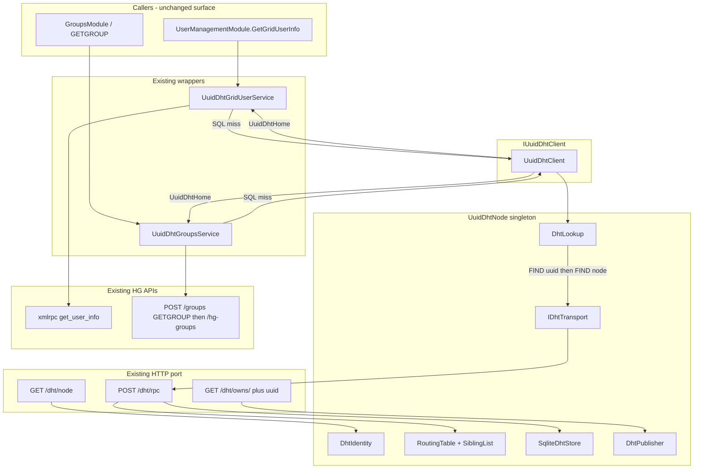
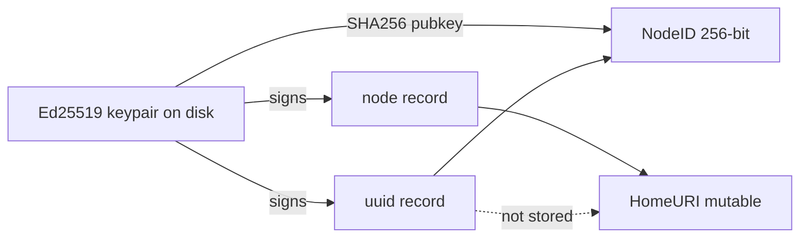
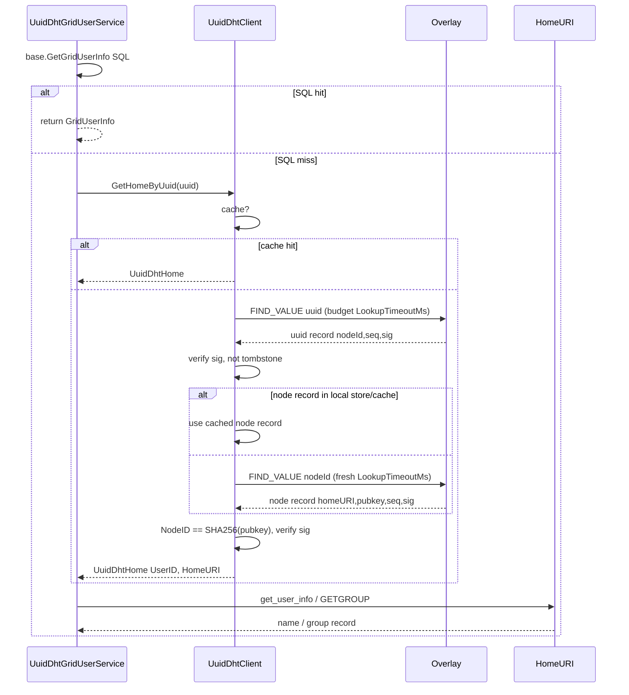
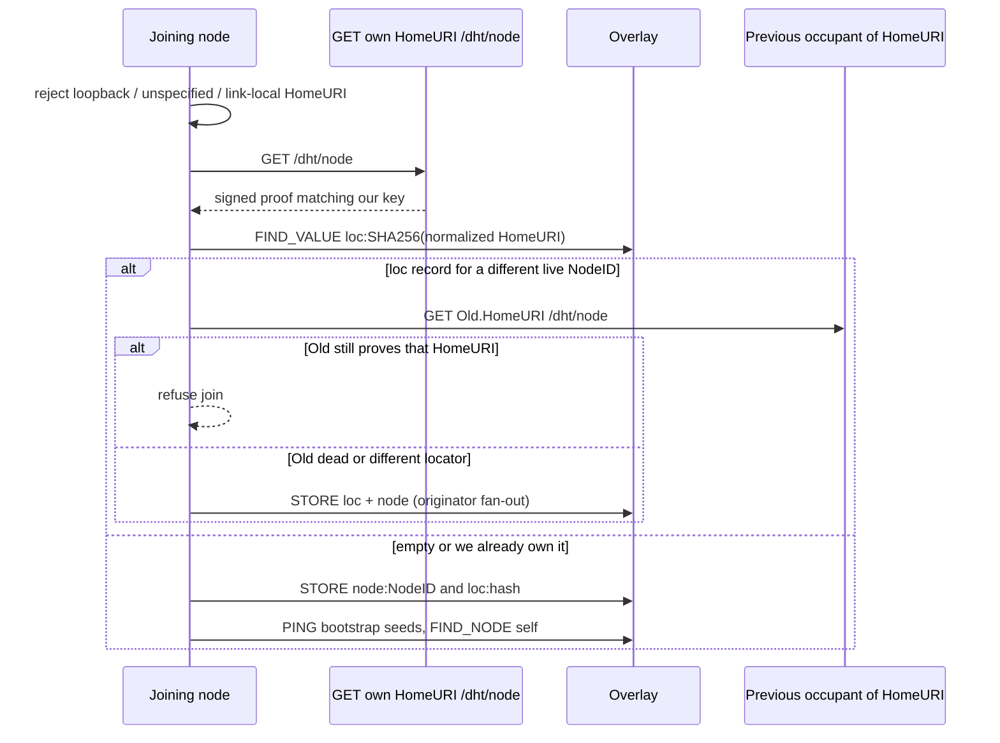
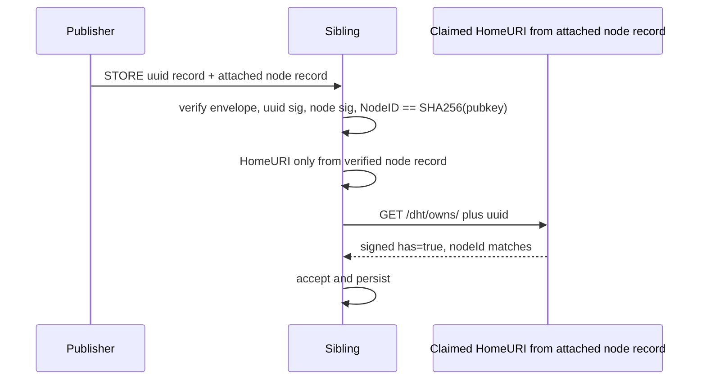

# UUID S/Kademlia DHT for OpenSimulator

| Field | Value |
| --- | --- |
| **Title** | UUID S/Kademlia DHT for OpenSimulator |
| **Author** | TBD |
| **Date** | 2026-09-19 |
| **Status** | Implemented on `UUID-DHT` (HG-only locator; public seeds this host :10001 then :10000) |
| **Branch** | `UUID-DHT` |
| **Addon** | `OpenSim/Addons/UUIDDHT/` (`OpenSim.Addons.UUIDDHT`, net8.0, BSD) |
| **Surface kept** | `IUuidDhtClient.GetHomeByUuid` / `GetGroupHomeByUuid` |

---

## Overview

OpenSim.Addons.UUIDDHT is an in-tree S/Kademlia overlay that, on a **Hypergrid** Groups or GridUser SQL miss, asks `IUuidDhtClient` for a HomeURI and then calls existing Hypergrid endpoints (`get_user_info`, `GETGROUP`). Intra-grid Robust and plain standalone do not fall back to DHT: absent from the local DB means it does not exist locally.

Public bootstrap seeds for this grid are `http://207.180.199.55:10001/` then `http://207.180.199.55:10000/` in `config-include/dht-seeds`. Admitted peers are rewritten into that file (this server first). The routing table is RAM-only; restart re-reads `dht-seeds` then FIND_NODE. Keep `uuiddht/identity-{port}.json` — that file is the NodeID, not the seed list.

No third-party Kademlia library is used. Groups and GridUser continue to see only `IUuidDhtClient`. Tests keep `FakeUuidDhtClient`. Default `[UuidDht] Enabled = false` until HG wiring is uncommented.

Identity is a persisted Ed25519 keypair per grid process. `NodeID = SHA256(pubkey)` (self-certifying; the network does not assign IDs). HomeURI (`http://host:port/`) is mutable signed locator metadata, not part of NodeID. The DHT maps `UUID → NodeID`, then `NodeID → HomeURI`, so a grid can change domain/port and still own its UUIDs. Transport is HTTP only, on the existing Robust public port or standalone `http_listener_port`. Two standalone sims on one machine are two processes, two keypairs, two NodeIDs, two HomeURIs.

Construction of `UuidDhtNode` is not join: identity and store load in `GetOrCreate`; HTTP handlers register next; `Start()` then bootstraps. GridUser SQL-first is a separate early PR, independent of the overlay.

---

## Background & Motivation

### Current state

| Piece | Path | Behavior |
| --- | --- | --- |
| Surface | `OpenSim/Addons/UUIDDHT/IUuidDhtClient.cs` | `UuidDhtHome { UserID, HomeURI }`; `GetHomeByUuid` / `GetGroupHomeByUuid` |
| Client | `UuidDhtClient.cs` | FIND uuid then FIND node under `ClientLookupCapMs` |
| GridUser wrapper | `UuidDhtGridUserService.cs` | SQL first; DHT only on miss; then `UuidDhtHomeNameService` (`GetUserInfo`, 5s cap) |
| Groups wrapper | `UuidDhtGroupsService.cs` | SQL first via `GroupsService.GetGroupRecord`; DHT only on miss; then `UuidDhtHomeGroupService` (`GETGROUP`, 5s cap) |
| Seeds | `config-include/dht-seeds` | `http://207.180.199.55:10001/` then `:10000/`; rewritten with admitted peers |
| Flag | `bin/OpenSimDefaults.ini` `[UuidDht] Enabled = false` | Uncomment HG LocalServiceModules on Robust.HG / StandaloneHypergrid |

DHT hits are **not** persisted to GridUser SQL (by design: locator, not authority).

### Pain points

1. The placeholder cannot resolve any real foreign UUID.
2. There is no production S/Kademlia C# library suitable for embedding in OpenSim.
3. Hypergrid already has `HomeURI` / `GatekeeperURI`, `get_user_info`, and `GETGROUP`. The DHT should only answer “which HomeURI owns this UUID?”, not duplicate user/group data.
4. Binding identity to `domain:port` would drop UUID ownership on a DNS or port change. NodeID must be a key, HomeURI a signed locator.
5. Two standalones on one host (different `http_listener_port`) must be distinct DHT nodes.
6. GridUser skip-SQL is a production bug with StandaloneCommon `Enabled = true`: local users lose home/position/online, and `GetGridUserInfo(string[])` never hits DHT (`UserManagementModule` uses the batch overload).

### What stays

- `IUuidDhtClient`, `UuidDhtHome`, `IUuidDhtHomeNameService`, `IUuidDhtHomeGroupService`.
- `UuidDhtHomeNameService` / `UuidDhtHomeGroupService` HTTP to home (GetUserInfo / GETGROUP).
- `FakeUuidDhtClient` and the SQL-hit / disabled tests.
- `[UuidDht] Enabled` as the master switch.
- One NodeID per **grid process** (Robust, or the standalone OpenSim process), never per region.

---

## Goals & Non-Goals

### Goals

- In-tree S/Kademlia: sibling list, `d` disjoint lookup paths, signed values, client-side `NodeID == SHA256(pubkey)` verification.
- Two primary signed, replicated record types (`uuid:` and `node:`), plus one auxiliary locator index (`loc:`) required to enforce HomeURI uniqueness (see Key Decisions).
- HTTP-only RPC on the existing public HTTP port. No extra UDP, no extra DHT port.
- Join/move via HTTP proof of HomeURI control.
- UUID STORE accepted only after a callback to the claimed HomeURI (`GET /dht/owns/<uuid>`).
- Publish at account/group creation (and backfill at start via a real list-all API), never lazily on first foreign lookup.
- Hard **per-FIND** lookup budget that fits PING/proof then FIND rounds on a ~150 ms RTT (see Contact admission), while `GetGridUserInfo` / `GetGroupRecord` still cannot stall HG login unboundedly.
- Config keys added under `[UuidDht]` without breaking `Enabled=false` or existing Fake tests.

### Non-Goals

- Drop-in third-party Kademlia (Alethic, Clifton, FaasNet, Makaretu).
- Proof-of-work / crypto puzzles (explicitly rejected; Sybil cost is a reachable HomeURI + key).
- Persisting DHT hits into GridUser SQL.
- Per-region NodeIDs.
- Storing names, profiles, inventory, or group membership in the DHT. The DHT is a locator.
- NAT traversal, UDP, or a separate DHT daemon.
- Replacing Hypergrid; this is a UUID→home index in front of existing HG APIs.
- Cross-signing or a CA. Keys are self-certifying.
- Changing timeouts on `UuidDhtHomeNameService` / `UuidDhtHomeGroupService` (post-DHT GetUserInfo / GETGROUP can still stall; called out, out of scope).

---

## Proposed Design

### Architecture



One `UuidDhtNode` per process. `UuidDhtGridUserService` and `UuidDhtGroupsService` both construct `UuidDhtClient` (`UuidDhtGridUserService.cs:61`, `UuidDhtGroupsService.cs:60`). That must share a process singleton. **`GetOrCreate` loads identity and store; it does not join and does not register HTTP.** Join is `Start()`, called only after handlers exist.

### Process placement

| Deployment | Where the node lives | HTTP port | Who looks up |
| --- | --- | --- | --- |
| Standalone / Standalone+HG | The OpenSim process | `[Network] http_listener_port` (e.g. 9000 / 10000) | `LocalGridUserServicesConnector` → `UuidDhtGridUserService`; Groups `LocalServiceModule` |
| Robust grid | **Robust only**, not each region | `[Const] PublicPort` (8002) | Regions talk to Robust GridUser/Groups as today; Robust runs the DHT |
| Two standalones on one host | Two processes | Two ports → two HomeURIs | Two identity files, two NodeIDs |

Region simulators in a Robust grid **do not** join the overlay. They keep using `RemoteGridUserServicesConnector` / Groups remote/HG connectors.

HTTP registration:

- **Robust:** `UuidDhtServiceConnector : ServiceConnector`, listed on the **public** port in `[ServiceList]` (same pattern as `HeloServiceInConnector` / `UserAgentServerConnector` in `bin/Robust.HG.ini.example`). Constructor has `IHttpServer` immediately: `GetOrCreate` → `AddStreamHandler` / `AddSimpleStreamHandler` → `Start()`.
- **Standalone:** `UuidDhtRegionModule : ISharedRegionModule` with **`[Extension(Path = "/OpenSim/RegionModules", NodeName = "RegionModule", Id = "UuidDhtRegionModule")]`**. Assembly `[assembly: Addin]` / `[assembly: AddinDependency]` is not enough; without Extension, Mono.Addins never loads the module and `/dht/*` is never mounted. Register on `MainServer.Instance` in `RegionLoaded` once (same pattern as `HypergridServiceInConnectorModule.cs:47` and `GroupsServiceHGConnectorModule.cs:49`).

`LocalGridUserServicesConnector.Initialise` constructs `UuidDhtGridUserService` **before** `RegionLoaded`. Client constructors may only `GetOrCreate` (identity + store). They must not GET their own `/dht/node` or PING seeds. The region module (or Robust connector) registers handlers, then `Start()`.

DHT paths have **no** `IServiceAuth`. They must be reachable by foreign grids, unlike `POST /groups`.

### Lifecycle (construction ≠ join)

```mermaid
sequenceDiagram
  participant Ctor as GridUser/Groups ctor
  participant Node as UuidDhtNode.GetOrCreate
  participant Conn as Robust connector or RegionLoaded
  participant HTTP as IHttpServer
  participant Join as Start/Join

  Ctor->>Node: GetOrCreate(config)
  Node->>Node: load identity + open SQLite
  Note over Node: handlers not up; no outbound HTTP
  Conn->>HTTP: register /dht/node, /dht/owns, /dht/rpc
  Conn->>Join: Start()
  Join->>Join: proof GET own /dht/node, bootstrap, STORE node+loc
```

`Start()` is idempotent (`lock` + `m_started`). Join/bootstrap runs on a thread-pool item so the Robust ctor / `RegionLoaded` does not block on seed RTTs.

Owns data sources (wired in `Start` / RegionLoaded, not in GetOrCreate):

- **Robust:** `ServerUtils.LoadPlugin<IUserAccountService>([UserAccountService] LocalServiceModule, config)`. A second `UserAccountService` instance is OK: `m_RootInstance` is already set (`UserAccountService.cs:89-91`), so console commands are not double-registered. Do **not** `LoadPlugin` a second `IGroupsService`; reuse the Groups instance already created by `GroupsServiceRobustConnector` if present, else owns-for-groups is false. Practical approach: `UuidDhtGroupsService` ctor calls `UuidDhtNode.GetOrCreate(config).SetGroupsService(this)` when Enabled.
- **Standalone:** `scene.RequestModuleInterface<IUserAccountService>()` in `RegionLoaded`. Groups: same `SetGroupsService(this)` from `UuidDhtGroupsService` ctor.

### Identity vs locator



- Losing the keypair **loses the node**. There is no recovery except publishing under a new NodeID (old UUID records remain until they expire unless the operator still has the key to tombstone them).
- HomeURI is **not** hashed into NodeID. Move = same key, prove new HomeURI, bump `node` seq, rewrite `loc:` index.

### Lookup path (client)

`UuidDhtClient.GetHomeByUuid` and `GetGroupHomeByUuid` share one UUID keyspace (OpenSim user and group UUIDs are globally unique; a collision is treated as one locator).



If either FIND fails, the signature is bad, the record is a tombstone, or HomeURI is unusable, return `null` (same as today’s miss).

Each FIND_VALUE has its own `LookupTimeoutMs` (default **1500 ms**) `CancellationToken`. The client cap for `GetHomeByUuid` is **3000 ms** (two FINDs). The second FIND is skipped when a verified `node:` for that NodeID is already in the local store or the positive node-record cache (normal after the first UUID from a grid). Per-RPC `RpcTimeoutMs` is 300 ms. 1500 ms fits about five sequential rounds at the 300 ms cap (FIND → in-lookup PING/proof → FIND → …), which is ≥2 FIND hops plus intervening admission on a 150 ms RTT.

**GridUser SQL-first** (lands in PR1, not with lookup): `UuidDhtGridUserService.GetGridUserInfo` currently skips SQL when Enabled. That contradicts `StandaloneCommon.ini` (“fallback when GetGridUserInfo has no local row”), drops home/position/online for local users, and does not override `GetGridUserInfo(string[])` which `UserManagementModule` uses (`UserManagementModule.cs:485,618,737`). New behavior matches Groups: SQL first, DHT only on miss; override both overloads.

After a DHT hit, `UuidDhtHomeNameService` / `UuidDhtHomeGroupService` still use existing connectors. `UuidDhtHomeGroupService.cs:82-83` calls `SynchronousRestFormsRequester.MakeRequest` with no timeout (WebUtil default **30 s**). That post-DHT stall is **out of scope** of this overlay work; the DHT budgets only the locator lookup.

### Join / move



**Move** (same key, publisher sequence; retry each step until ≥ `s/2` STORE successes):

1. Prove **new** HomeURI: `GET {newHome}dht/node` matches our NodeID/pubkey.
2. `STORE loc:{hash(newHome)}` (seq = 1, or last+1 if we previously owned this locator) to the `s` closest to that key.
3. Bump `nodeSeq`, `STORE node:` with the new HomeURI to the `s` closest to NodeID.
4. `DELETE` (tombstone) `loc:{hash(oldHome)}` to the `s` closest to the old loc key.

Partial failure: `Start()` re-runs this until `loc:` for the configured HomeURI is ours and the old loc is tombstoned (or absent). Crash after (2) and before (4) leaves two loc keys pointing at the same NodeID — harmless. Crash after (4) and before (3) is repaired by retrying (3).

### UUID STORE callback

Siblings do not trust a STORE of `uuid:` until the claimed home confirms ownership. The STORE body **must** carry the current signed `node` record. The handler never nested-FINDs.



Publish is triggered at account/group creation and by a start-up backfill, never by `GetHomeByUuid`.

### Originator-driven STORE fan-out

S/Kademlia stores on the `s` closest nodes to the key. The **originator** (publisher or joining node) does:

1. `FIND_NODE(dhtKey)` (same lookup engine, `LookupTimeoutMs`, **in-FIND PING/proof** so the `s` closest are overlay siblings, not only bootstrap seeds).
2. `STORE` in parallel to those `s` **verified** contacts (parallel cap `α`, default 3) plus self if we are among the `s` closest we know.
3. Success if **≥ `s/2`** (10 when `s=20`) peers return `ok:true`. Otherwise retry the failed contacts once, then log Warn and let 24 h republish repair.

Replicas that later become siblings pick up the value via FIND_VALUE caching (step 5 of lookup) and the owner’s republish (24 h), which is shorter than expire (36 h). A new sibling can be missing a key for up to one republish interval; that is accepted.

PR4 RPC is single-hop against the **local** store (handler implementation). Fan-out is used by join/publish (PR8/PR9) and by the lookup engine’s optional cache-STORE.

---

## File / class layout

All new types live under `OpenSim/Addons/UUIDDHT/` unless noted. `prebuild.xml` already compiles `*.cs` recursively excluding `Tests/` (`prebuild.xml:2018-2022`). The SDK csproj has `EnableDefaultItems=false` and an explicit `<Compile Include>` list (`OpenSim.Addons.UUIDDHT.csproj`). **Every new `.cs` file must be added to the csproj in the same PR** (or that PR enables a glob). prebuild regenerate is not a substitute for the SDK list.

```
OpenSim/Addons/UUIDDHT/
  IUuidDhtClient.cs                 // unchanged surface
  UuidDhtClient.cs                  // real two-level FIND (PR7)
  UuidDhtGridUserService.cs         // SQL-first + batch override (PR1)
  UuidDhtGroupsService.cs           // CreateGroup publish hook (PR9)
  UuidDhtHomeNameService.cs         // unchanged
  UuidDhtHomeGroupService.cs        // unchanged
  UuidDhtConfig.cs                  // typed [UuidDht] keys
  UuidDhtNode.cs                    // process singleton; GetOrCreate ≠ Start
  UuidDhtUserAccountService.cs      // required CreateUser hook (PR9)
  UuidDhtServiceConnector.cs        // Robust ServiceConnector
  UuidDhtRegionModule.cs            // [Extension] ISharedRegionModule
  Crypto/
    DhtIdentity.cs
    DhtSigner.cs
  Protocol/
    DhtKey.cs
    DhtPeer.cs
    DhtRecord.cs
    DhtRpcMessages.cs
    DhtCanonical.cs
    DhtJson.cs                      // WireOptions for body hashes
  Routing/
    KBucket.cs
    RoutingTable.cs
    SiblingList.cs
  Store/
    IDhtStore.cs
    SqliteDhtStore.cs
  Net/
    IDhtTransport.cs                // PR5, with HTTP + fake impls
    DhtHttpClient.cs                // no-redirect, IP re-check
    DhtFakeTransport.cs             // in-process, PR5 (not PR10)
    DhtRpcHandler.cs                // POST /dht/rpc
    DhtNodeDocumentHandler.cs       // GET/HEAD /dht/node SimpleStreamHandler
    DhtOwnsHandler.cs               // GET /dht/owns BaseStreamHandler
    DhtLookup.cs                    // PR6
  Publish/
    DhtPublisher.cs
    DhtLocator.cs
  Tests/
    FakeUuidDhtClient.cs
    DhtKeyTests.cs
    RoutingTableTests.cs
    DhtSignerTests.cs
    DhtStoreTests.cs
    DhtRpcHandlerTests.cs
    DhtLookupTests.cs
    DhtJoinTests.cs
    DhtIntegrationTests.cs
```

`OpenSim.Addons.UUIDDHT.csproj` / `prebuild.xml` additions:

- `OpenSim.Framework.Servers.HttpServer`
- `OpenSim.Server.Handlers` (for `ServiceConnector`)
- `OpenSim.Region.Framework` + `Mono.Addins` (region module)
- `BouncyCastle.Cryptography` HintPath `bin/BouncyCastle.Cryptography.dll` (already shipped; MailKit dependency)
- `System.Data.SQLite` HintPath `bin/System.Data.SQLite.dll` (already shipped)

`Properties/AssemblyInfo.cs` (matching Groups):

```csharp
[assembly: Addin("OpenSim.UUIDDHT", OpenSim.VersionInfo.VersionNumber)]
[assembly: AddinDependency("OpenSim.Region.Framework", OpenSim.VersionInfo.VersionNumber)]
```

Region module **also** needs the type-level Extension (Issue 9):

```csharp
[Extension(Path = "/OpenSim/RegionModules", NodeName = "RegionModule", Id = "UuidDhtRegionModule")]
public class UuidDhtRegionModule : ISharedRegionModule { ... }
```

---

## HTTP paths

OpenSim already multiplexes small public GETs with `SimpleStreamHandler` (`/helo`, `/json_grid_info`) and form POSTs with `BaseStreamHandler` (`POST /groups`, `POST /hg-groups`). There are **no ASP.NET `{uuid}` route templates**.

`BaseHttpServer` routing (`OpenSim/Framework/Servers/HttpServer/BaseHttpServer.cs`):

| API | Match | Use for |
| --- | --- | --- |
| `AddSimpleStreamHandler(handler)` | exact path in `m_simpleStreamHandlers` | `/dht/node` |
| `AddSimpleStreamHandler(handler, varPath: true)` | first segment only (`uripath.IndexOf('/', 2)` → `/dht` for `/dht/owns/…`) | **not** `/dht/owns/…` (would steal `/dht/node` or 404) |
| `AddStreamHandler(BaseStreamHandler)` | prefix via `handlerKey.StartsWith` (`TryGetStreamHandler`, lines 1024–1047) | `/dht/owns`, `/dht/rpc` |

`Util.TrimEndSlash` is applied to inbound paths (`BaseHttpServer.cs:705`). Register handlers **without** a trailing slash.

| Method | Path registered | Handler | Auth | Purpose |
| --- | --- | --- | --- | --- |
| GET, HEAD | `/dht/node` | `DhtNodeDocumentHandler : SimpleStreamHandler` (`base("/dht/node")`) | none | Proof-of-control. Branch on `httpRequest.HttpMethod` (Helo pattern). |
| GET | `/dht/owns` | `DhtOwnsHandler : BaseStreamHandler("GET", "/dht/owns")` | none | STORE callback. UUID = `GetParam(path)` / `SplitParams` (e.g. path `/dht/owns/51e2de20-…` → param `/51e2de20-…`). |
| POST | `/dht/rpc` | `DhtRpcHandler : BaseStreamHandler("POST", "/dht/rpc")` | none | PING, STORE, FIND_NODE, FIND_VALUE, DELETE |

Inbound owns URL is `{homeURI}dht/owns/{uuid}` because HomeURI is normalized with a trailing slash (`http://grid.example:8002/` + `dht/owns/` + uuid).

**Why one RPC path:** Kademlia multiplexes opcodes on one socket. One handler keeps versioning (`v`) and request signing in one place.

**Why `/dht/` prefix:** no collision with `/groups`, `/hg-groups`, `/helo`, `/json_grid_info`, XmlRpc `get_user_info`.

**Why GET for proof and owns:** join/move and sibling callbacks are simple fetches. RPC stays POST because it carries bodies.

Handlers register on the **same** `IHttpServer` as HG (Robust public port or standalone `MainServer.Instance`). No second listener.

---

## Wire format

JSON via `System.Text.Json` (net8.0 BCL; already used in `OpenSim/Region/Framework/Scenes/LinksetData.cs`). Not OSD/LLSD. Not Newtonsoft. Not form-urlencoded.

Content-Type: `application/json; charset=utf-8`.

Encoding:

- Integers: JSON numbers (`seq`, `ts`). `seq` is a signed 64-bit integer (`long` in C#, SQLite `INTEGER`). Must be `>= 1`.
- NodeID, SHA256 keys, signatures, pubkeys, body hashes: **lowercase hex**.
- UUID: `OpenMetaverse.UUID.ToString()` (dashed, canonical).
- HomeURI: normalized string (see Locator rules).
- Timestamps: Unix seconds UTC.

### Canonical sign-input (not JSON)

JSON canonicalization is a bug farm for **records**. Signatures cover an explicit UTF-8 string. Fields are separated by `|`. Implementations must not trim HomeURI beyond the normalizer.

| Kind | Canonical string |
| --- | --- |
| node record | `node-v1|{nodeId}|{homeURI}|{pubkey}|{seq}` |
| uuid record | `uuid-v1|{uuid}|{nodeId}|{seq}|{tombstone}` where tombstone is `0` or `1` |
| loc record | `loc-v1|{homeHash}|{nodeId}|{homeURI}|{seq}|{tombstone}` |
| proof document | `proof-v1|{nodeId}|{homeURI}|{pubkey}|{ts}` |
| owns document | `owns-v1|{uuid}|{nodeId}|{homeURI}|{has}|{ts}` where has is `0` or `1` |
| RPC **request** | `rpc-v1|{op}|{sender}|{senderHome}|{nonce}|{ts}|{bodyHash}` |
| RPC **response** | `rpc-resp-v1|{op}|{sender}|{nonce}|{ts}|{ok}|{error}|{bodyHash}` |

`ok` in the response sign-input is `1` or `0`. `error` is the string or empty.

**`bodyHash`:** lowercase hex SHA256 of the UTF-8 bytes produced by `JsonSerializer.Serialize(payload, DhtJson.WireOptions)` where:

```csharp
static class DhtJson
{
    public static readonly JsonSerializerOptions WireOptions = new JsonSerializerOptions
    {
        PropertyNamingPolicy = JsonNamingPolicy.CamelCase,
        WriteIndented = false,
        DefaultIgnoreCondition = JsonIgnoreCondition.WhenWritingNull,
        Encoder = JavaScriptEncoder.UnsafeRelaxedJsonEscaping
    };
}
```

DTO property order is locked with `[JsonPropertyOrder]`. Request payload is the `body` object (PING: `{}`). Response payload is `{ "peers": [...], "value": ... }` (null value omitted by WhenWritingNull; still hash the serialized object that is signed). Verify by re-serializing the parsed DTO, not by hashing raw request bytes (whitespace would break).

`sig` is Ed25519 over those canonical bytes (not over the JSON envelope). Verify: decode pubkey, check `SHA256(pubkey) == sender` (RPC) or `== nodeId` (records), then `Ed25519.Verify`.

Reject the envelope if `senderHome` fails locator rules. After the sender is proven, `senderHome` must equal the verified node-record HomeURI (STORE uuid uses the **attached** node record, not `senderHome`, for owns callbacks).

Clock skew allowed on `ts`: ±300 seconds. Replay window: reject a `(sender, nonce)` pair seen in the last 10 minutes (in-memory, bounded, see Concurrency).

Unknown `v` (not `1`) or unknown `op`: HTTP 200, `ok: false`, `error: "malformed"`. Oversized body: HTTP 413.

### GET `/dht/node` — proof-of-control

```json
{
  "v": 1,
  "nodeId": "64-char hex SHA256(pubkey)",
  "homeURI": "http://grid.example:8002/",
  "pubkey": "64-char hex Ed25519 public key",
  "ts": 1789737600,
  "seq": 4,
  "sig": "128-char hex Ed25519 signature"
}
```

`seq` here is the current node-record sequence so a prover can show freshness relative to DHT state. Sign-input is `proof-v1|...` (does not include `seq`; `ts` is the freshness field).

HEAD `/dht/node` returns `200` and `X-Dht-NodeId: {nodeId}` without a body (cheap liveness). `SimpleStreamHandler` accepts any method; the handler checks `httpRequest.HttpMethod`.

### GET `/dht/owns/<uuid>`

Handler path prefix `/dht/owns`. UUID from `GetParam`. Unparseable UUID → HTTP 400.

```json
{
  "v": 1,
  "uuid": "51e2de20-ec0a-4840-9b7a-b3990775a624",
  "nodeId": "...",
  "homeURI": "http://grid.example:8002/",
  "has": true,
  "ts": 1789737600,
  "sig": "..."
}
```

`has` is true iff local `IUserAccountService.GetUserAccount(UUID.Zero, uuid)` is non-null **or** local `IGroupsService.GetGroupRecord(..., uuid)` is non-null and is **not** a group proxy (`Location` empty). Foreign proxies must not be re-published as ours.

### POST `/dht/rpc` envelope

Request:

```json
{
  "v": 1,
  "op": "PING",
  "sender": "64-char hex nodeId",
  "senderHome": "http://peer.example:8002/",
  "pubkey": "64-char hex",
  "nonce": "32-char hex",
  "ts": 1789737600,
  "sig": "128-char hex",
  "body": { }
}
```

Response (HTTP 200 even for protocol-level failure; `ok` is the protocol status). HTTP 4xx only for malformed JSON / oversized body. Responses **are signed** (same Ed25519 key as the responder):

```json
{
  "v": 1,
  "op": "PING",
  "ok": true,
  "error": null,
  "sender": "our nodeId",
  "senderHome": "http://us.example:8002/",
  "pubkey": "our pubkey hex",
  "nonce": "echo request nonce",
  "ts": 1789737600,
  "sig": "128-char hex",
  "peers": [ { "nodeId": "...", "homeURI": "http://..." } ],
  "value": null
}
```

Clients drop responses whose envelope sig fails or `SHA256(pubkey) != sender`.

Every successful RPC may return `peers`: the `k` closest **known** contacts to the request key (or to the sender for PING). **`peers` are candidates only** (see Contact admission). Body size cap: 32 KiB request, 64 KiB response.

### PING

`op: "PING"`, `body` `{}`. Receiver: verify envelope (including `bodyHash` of `{}` and `senderHome`). Do **not** insert sender into a bucket until proof/PING admission completes **off** the handler’s critical path (see Concurrency). Reply signed `ok:true` plus `k` closest to sender.

### FIND_NODE

```json
"op": "FIND_NODE",
"body": { "key": "64-char hex" }
```

Reply `peers`: `k` closest known contacts to `key`. No `value`.

### FIND_VALUE

```json
"op": "FIND_VALUE",
"body": { "key": "64-char hex" }
```

If the receiver has a non-expired record whose DHT key equals `key`, return it in `value` **and** still return `peers` (S/Kademlia: client verifies among siblings; do not stop at the first node). If not, `value` is null and `peers` is the closest `k`.

`value` shape:

```json
{
  "kind": "uuid" | "node" | "loc",
  "key": "uuid:51e2de20-ec0a-4840-9b7a-b3990775a624",
  "dhtKey": "64-char hex",
  "nodeId": "...",
  "homeURI": "http://.../",
  "pubkey": "...",
  "uuid": "...",
  "seq": 7,
  "tombstone": false,
  "sig": "..."
}
```

Unused fields are omitted (`uuid` only on uuid records, `homeURI`/`pubkey` on node and loc, etc.).

### STORE

```json
"op": "STORE",
"body": {
  "record": { /* value object as above */ },
  "node": { /* required for uuid non-tombstone: current signed node record */ }
}
```

Receiver validation (all must pass). **No nested FIND** on this handler.

1. Envelope sig valid; `SHA256(pubkey_envelope) == sender`; `senderHome` passes locator rules; `bodyHash` matches re-serialized `body`.
2. Record sig valid under the **record owner** key (uuid/loc/node `nodeId`).
3. `dhtKey` matches `DhtKey.For(record)`.
4. `seq >= 1`. Then **by kind** (the table is `PRIMARY KEY (dht_key)` — one row per key):
   - **uuid and node — seq is global per `dht_key`:** if a row exists (live **or** tombstone), `record.nodeId` MUST equal stored `node_id` (else `taken`) **and** `seq` MUST be strictly greater than stored `seq` (else `stale_seq`). If no row, accept. A different NodeID cannot replace a live or tombstoned uuid/node row. The key must expire empty before anyone else may STORE it. Do **not** compare seq “per owner”.
   - **loc** is the **only** kind that may replace a **dead** occupant regardless of seq (step 9). Same owner / empty key: global seq as above (`seq` > stored, same `nodeId`).
5. Tombstone: only the same `nodeId` may tombstone; cannot resurrect except with higher **global** seq and `tombstone=false` from that same owner.
6. **node record:** `nodeId == SHA256(pubkey)`; HomeURI passes locator rules; proof callback `GET {homeURI}dht/node` matches this key (timeout `CallbackTimeoutMs`). Then apply **loc uniqueness** (same algorithm as loc STORE below) for this HomeURI. (The node record’s DHT key *is* the NodeID, so “different nodeId on the same key” cannot occur for a well-formed node STORE; step 4 still applies to seq.)
7. **uuid record (non-tombstone):** `body.node` must be present. Verify that node record’s sig and `nodeId == SHA256(pubkey)` and `body.node.nodeId == record.nodeId`. HomeURI for the owns callback is **only** `body.node.homeURI` (never `senderHome`, never a FIND). If the local store already has a verified `node:` for that id with `seq >= body.node.seq`, that stored HomeURI may be used instead of the attached one; if stored seq is older, use attached after verify. Then `GET {homeURI}dht/owns/{uuid}` must return `has=true` and the same `nodeId`. Cap: local live uuid rows with this `nodeId` < `MaxUuidsStoredPerOwner`. Missing `body.node` → `malformed`. Owns-true does **not** override step 4: Mallory proving `has=true` for Alice’s UUID is still `taken`.
8. **uuid tombstone:** no owns callback; no attached node required; step 4 still requires the same `nodeId` and higher seq.
9. **loc record:** HomeURI hash matches key; locator rules pass. **Uniqueness:** if the store already has a **live** loc for this key with a **different** `nodeId`, GET the occupant’s `{stored.homeURI}dht/node`. If that proof succeeds and still claims this HomeURI → `home_taken`. If proof fails (timeout, bad sig, different HomeURI, different nodeId) → treat occupant as dead and **accept the new loc regardless of the old seq** (new owner starts at `seq >= 1`). Same owner or empty key: global seq (step 4 loc same-owner branch).

On success persist and return `ok:true`. On failure `ok:false` with `error` one of: `bad_sig`, `stale_seq`, `taken`, `bad_locator`, `home_taken`, `owns_failed`, `cap`, `malformed`.

### DELETE

Alias for STORE of the same key with `tombstone: true` and bumped `seq`. Kept as a distinct `op` so publishers do not have to remember the tombstone flag.

Same validation as STORE; `owns` callback is **not** required for tombstones (the owner may already have deleted the account).

### Replica merge (FIND_VALUE client)

When several verified values exist for one key:

- Drop expired records and unverifiable sigs.
- **uuid and node:** take the highest **global** `seq`. That record’s `nodeId` is the owner. If two different `nodeId`s share that highest seq → **keep neither**, log Warn (should not happen if STORE step 4 is applied). Do not prefer a lower-seq other owner.
- If two verify with the **same** `nodeId` and `seq` but are not byte-identical → miss, log.
- **loc: two live different nodeIds:** proof-check both via GET `/dht/node` at each record’s HomeURI (they should be the same locator). Whoever currently proves this HomeURI wins. If both prove or neither proves → **keep neither**, log Warn (`[UUID-DHT]: loc split-brain key={…}`). Do not serve a split loc to `GetHomeByUuid`.

---

## Signature algorithm

**Choice: Ed25519.** Rejected alternatives below.

| Algorithm | Keys / sig | Why not / why |
| --- | --- | --- |
| **Ed25519** | 32-byte pub, 64-byte sig | Fast, small, deterministic, standard for libp2p/IPFS-style DHTs |
| RSA-2048 | ~256-byte pub, 256-byte sig | Inflates every RPC and record; slower verify on FIND |
| ECDSA P-256 | 33-byte compressed pub, ~64-byte sig | In BCL, but nonce pitfalls and malleability; no size win over Ed25519 |

.NET 8 BCL has RSA and ECDSA, **not** Ed25519 (`System.Security.Cryptography` 8.0 has no Ed25519 type). OpenSim already ships `bin/BouncyCastle.Cryptography.dll` (MailKit). Use that via HintPath, types `Org.BouncyCastle.Math.EC.Rfc8032.Ed25519` / `Ed25519PrivateKeyParameters` — pin to the methods present in the bin DLL during the identity PR.

NodeID:

```
pubkey     = 32-byte Ed25519 public key (raw, not SPKI)
NodeID     = SHA256(pubkey)            // 32 bytes, 64 hex chars
```

Do **not** hash HomeURI into NodeID.

### Identity file

Default path (config `IdentityPath`):

```
bin/uuiddht/identity-{port}.json
```

`{port}` is Robust `PublicPort` or standalone `http_listener_port`. Two processes sharing `bin/` therefore do not clobber keys.

Permissions: on Unix (`OperatingSystem.IsLinux()` / `IsMacOS()`) create with `UnixFileMode` `0600`. On Windows, do not pretend to chmod; log that the file contains the node private key. Never log the private key.

```json
{
  "v": 1,
  "alg": "Ed25519",
  "priv": "<base64 raw 32 bytes>",
  "pub": "<base64 raw 32 bytes>",
  "nodeId": "<hex SHA256(pub)>",
  "nodeSeq": 1
}
```

`nodeSeq` is `long`, starts at **1**. Uuid and loc publisher seqs also start at **1**.

Load rules (`DhtIdentity.LoadOrCreate` + store open, together in `GetOrCreate`):

1. If **both** identity file and store file are absent → generate identity, persist, create empty store, log `[UUID-DHT]: created node identity {nodeId} at {path}`.
2. If identity exists → load; refuse to start if `SHA256(pub) != nodeId`.
3. If identity is **missing** but the store contains a `node:` row whose `node_id` is **not** the NodeID we would generate (or any `node:` row at all) → **refuse to start**. Log error: restore `identity-{port}.json` or delete the store. Do not mint a new key next to a populated store.
4. If identity exists and store has `node:` for a **different** `node_id` → **refuse to start** (same message).

Losing the identity file loses the node unless the operator still has a backup.

`DhtIdentity` API:

```csharp
public sealed class DhtIdentity
{
    public byte[] PublicKey { get; }
    public DhtKey NodeId { get; }
    public long NodeSeq { get; }

    public static DhtIdentity LoadOrCreate(string path, IDhtStore store);
    public byte[] Sign(byte[] canonicalUtf8);
    public static bool Verify(byte[] pubkey, byte[] canonicalUtf8, byte[] sig);
    public static DhtKey NodeIdFromPubkey(byte[] pubkey); // SHA256
    public long BumpNodeSeq(); // lock + persist
}
```

---

## Kademlia / S/Kademlia parameters

| Parameter | Symbol | Default | Notes |
| --- | --- | --- | --- |
| Key / NodeID width | `B` | 256 | SHA256; `DhtKey` is 32 bytes |
| Bucket size | `k` | 20 | Standard Kademlia |
| Lookup parallelism per path | `α` | 3 | |
| Sibling list size | `s` | 20 | = `k`; originator STOREs to `s` closest |
| Disjoint lookup paths | `d` | 3 | S/Kademlia; no shared contacts across paths |
| Per-RPC timeout | | 300 ms | `RpcTimeoutMs`; one round ≈ one RTT when `α` is parallel |
| Per-FIND budget | | 1500 ms | `LookupTimeoutMs`; fits FIND + in-lookup PING/proof + FIND (≈5 rounds at 300 ms cap) |
| Client two-level cap | | 3000 ms | `GetHomeByUuid` (two FINDs; node FIND often cached) |
| Owns / proof callback | | 500 ms | one retry |
| Bucket refresh | | 3600 s | FIND_NODE random in stale buckets |
| Republish | | 24 h | owner re-STOREs live records; shorter than expire so joiners heal |
| Expire | | 36 h | store drops live records if not republished |
| Proof ts skew | | 300 s | |
| Max RPC body | | 32 KiB in / 64 KiB out | |
| Max live uuid rows per owner **on one store** | | 100000 | `MaxUuidsStoredPerOwner` ≥ `MaxPublishUuids` |
| Max UUIDs this node will publish | | 100000 | `MaxPublishUuids` |
| Negative cache | | 60 s | |
| Positive cache | | 600 s | uuid → UuidDhtHome; also nodeId → node record |
| Contact fail | | 5 | drop from bucket after 5 missed RPCs |
| Bootstrap retry | | 30 s, then 5 min | |
| STORE fan-out success | | `s/2` | originator retries once |

Expected scale: tens to low thousands of **grids**. A single grid may publish up to `MaxPublishUuids` user+group UUIDs; replicas must accept that many from one owner. Storage: 100k records × ~400 bytes ≈ 40 MB plus SQLite overhead — fine on Robust/standalone. Each NodeID already requires a reachable HomeURI (the expensive Sybil cost); the replica cap is aligned with the publisher cap, not a tighter DoS guess.

### DHT keys

`DhtKey` is 256-bit big-endian. Distance = XOR, compared as unsigned big-endian.

| Record | DHT lookup key | Stored `key` string |
| --- | --- | --- |
| uuid | `SHA256("uuid:" + uuid.ToString())` | `uuid:{uuid}` |
| node | the NodeID itself | `node:{nodeIdHex}` |
| loc | `SHA256("loc:" + normalizedHomeURI)` | `loc:{homeHashHex}` |

UUID is 128-bit; hashing into 256-bit space avoids clustering in the low half. Node records sit at the node’s own ID so a node’s siblings keep its locator.

### Routing table

`RoutingTable`: 256 k-buckets, bucket `i` holds up to `k` contacts with XOR distance in `[2^i, 2^{i+1})`. Replacement: ping head if bucket full (Kademlia) — ping runs **without** holding the bucket lock (see Concurrency). Contacts: `{ NodeId, HomeURI, LastSeen, FailCount }`.

`SiblingList`: the `s` closest known nodes to **self**, including self. Used for “am I responsible for this key?” (`distance(self,key)` among `s` closest known). STORE is still accepted if we are among the `s` closest we know; we do not require a global view.

**Contact admission (no PoW) — never FIND/STORE-query an unverified peer:**

- FIND-returned `peers` are **candidates**, not next hops.
- A contact is **verified** after a direct PING to its HomeURI succeeds **or** `GET {homeURI}dht/node` verifies and `SHA256(pubkey) == nodeId` and HomeURI matches.
- **In the current FIND** (same child `LookupTimeoutMs` CTS, parallelism `α`): PING/proof closer unverified candidates. Only after that admission may they be FIND-queried in the **next round of this same lookup**. Do not defer admission to a later `GetHomeByUuid`.
- Background (thread-pool) admission remains for **bucket fill** and ping-replace only — not a substitute for in-lookup verification. Without in-FIND admission, `FIND_NODE(self)` after bootstrap cannot leave the seed set, and originator STORE would replicate to seeds instead of the `s` closest.
- Still **never** send FIND_NODE / FIND_VALUE / STORE to a contact before PING/proof succeeds.
- Do not insert into a k-bucket until verified.
- If a path has no verified contact left and no remaining candidates to PING inside `ct`, that path ends; other disjoint paths continue. If all paths empty, miss.
- Signed responses stop envelope splicing; in-FIND PING then query stops a lying-but-valid node from being followed as the next hop in the **current** iteration.

This is the S/Kademlia “verify before use” substitute for crypto puzzles, applied to lookup as well as bucket fill.

### Disjoint iterative lookup

`DhtLookup.FindValue(DhtKey key, CancellationToken ct)` / `FindNode`:

1. Linked to the caller token; each FIND creates a child CTS of `LookupTimeoutMs` (1500 ms).
2. From the routing table, take **verified** contacts; partition into `d` disjoint sets. (After `Start()`, seeds are verified; that is enough to begin.)
3. Run `d` iterative lookups in parallel. Each **round**:
   - **Admit:** PING/proof up to `α` unverified candidates that are closer than the path’s closest verified contact (`GetNode` or PING, same child CTS). Newly verified contacts become eligible for the **next** round.
   - **Query:** FIND_NODE/FIND_VALUE to up to `α` verified unqueried contacts in that path (`DhtHttpClient.Rpc(..., ct)`). Collect `value` and `peers`. Unverified `peers` are candidates for the next admit step, not next hops.
   - First round has no new candidates yet: query verified seeds/table only, then admit from their `peers`.
4. Stop a path when a round yields no closer verified node and no candidate that verified, or `ct` fires.
5. Union results. For FIND_VALUE, collect values from all responders; replica-merge (above).
6. After FIND_VALUE, if we are among the `s` closest to the key and the value is valid, cache it locally (S/Kademlia caching).

Round cost: one admit RTT + one query RTT when both run. 1500 ms ≈ five 300 ms rounds (e.g. query, admit, query, admit, query) on a 150 ms RTT with slack if hops are faster. **Do not** skip PING to stay inside 800 ms.

Offline lookup **cannot** rely only on k-buckets: values live on the sibling set of the **key**. FIND_VALUE must contact those siblings. Local `SqliteDhtStore` is the replica, not the routing table.

`DhtHttpClient` methods take `CancellationToken` and pass it to `HttpClient.SendAsync`. Lookup does not use `HttpClient.Timeout`; it uses the token.

---

## Concurrency

OpenSim HTTP workers, scene-thread `GetHomeByUuid`, bucket refresh, expire, republish, and join all share one `UuidDhtNode`. Every mutable structure has a specified lock. **No 30 s SQLite busy wait on the RPC path.**

| Object | Safety |
| --- | --- |
| `UuidDhtNode.GetOrCreate` | `lock (s_initLock)` (or `Lazy<T>` with `ExecutionAndPublication`). First caller constructs; others wait. Does not join. |
| `UuidDhtNode.Start` | `lock (m_startLock)`; idempotent `m_started`. Join/bootstrap `ThreadPool.QueueUserWorkItem`. |
| `DhtIdentity` / `BumpNodeSeq` | `lock (m_idLock)` around seq bump + file write. |
| `RoutingTable` / `KBucket` / `SiblingList` | `lock (m_rtLock)` for mutations and snapshots. Return copied lists. **Ping-replace and proof callbacks must not run under this lock.** Snapshot the eviction candidate, release, PING/proof async, re-acquire to insert. STORE/FIND handlers never sync-wait a PING. |
| `SqliteDhtStore` | Single connection. `lock (m_dbLock)` around every command. Set `busy_timeout=1000` (1 s), **not** `SQLiteConnectionHelper`’s 30000 (`OpenSim/Data/SQLiteConnectionHelper.cs`). This process serializes writers via `m_dbLock`, so busy should not fire; if it does, fail the STORE (`error` / exception) rather than wait past `RpcTimeoutMs`. PR3 includes this contract and tests with concurrent Put/TryGet. |
| Replay `(sender,nonce)` | `ConcurrentDictionary` or lock + `Dictionary`; cap 10k; sweep by `ts`. |
| Rate limiter | `ConcurrentDictionary<IPAddress, TokenBucket>` (20 req/s, burst 40). |
| Lookup / node-record caches | `ExpiringCacheOS` (already used in OpenSim) or `ConcurrentDictionary` + ticks. |
| `DhtHttpClient` | **One** long-lived `HttpClient` for the process, wrapping a **private** `SocketsHttpHandler { AllowAutoRedirect = false, ConnectCallback = IP reject }` owned by `DhtHttpClient`. `Timeout = InfiniteTimeSpan`; per-call `CancellationToken`. Do **not** call `WebUtil.GetNewGlobalHttpClient` per RPC. Do **not** attach `ConnectCallback` to `WebUtil.SharedSocketsHttpHandlerNoRedir` (process-wide; would break Janus and every other no-redir client). |
| Publisher / expire / refresh timers | `System.Threading.Timer`; work items take the same store/routing locks as above, never nested in the HTTP handler’s admission ping. |

Immutable after construct: `DhtKey`, verified `DhtRecord` copies, `UuidDhtConfig` snapshot.

---

## Data model

### Records

**uuid record** (primary):

```
uuid:{uuid} → { nodeId, seq, tombstone, sig }
```

Only the owner key may add or tombstone. Seq is **global per `dht_key`**: a different NodeID cannot replace a live or tombstoned uuid row (`taken`). The row must expire empty before another owner may STORE. Owns-callback `has=true` does not override that. Lookup: FIND uuid → nodeId. Initial `seq` is **1**.

**node record** (primary):

```
node:{nodeId} → { homeURI, pubkey, seq, sig }
```

`nodeId` MUST equal `SHA256(pubkey)`. HomeURI mutable with **global** seq bump on that NodeID key. Initial `seq` is **1**. A different keypair cannot STORE `node:{ourNodeId}`.

**loc record** (auxiliary index — required):

```
loc:{SHA256(normalized HomeURI)} → { nodeId, homeURI, seq, tombstone, sig }
```

The two primary types cannot enforce “this HomeURI is already proven for a different live NodeID”, because that query is by locator, not by NodeID. `loc:` is the reverse index. Signed by the same owner key. Tombstone on move. Uniqueness is enforced **on loc STORE** (and on node STORE’s HomeURI), not only at join. **Loc is the only kind** that may replace a dead occupant (proof-fail) regardless of seq.

### Local store (SQLite file, no new server)

Do **not** add an `OpenSim.Data.*` plugin or piggyback GridUser/Groups tables. Use `System.Data.SQLite` (already in `bin/`, used by standalone) with a dedicated file:

```
bin/uuiddht/store-{port}.db
```

Config `StorePath` overrides. Two standalones sharing `bin/` therefore do not share a store.

Schema (created on open; no OpenSim.Data migration). `seq` is signed 64-bit (SQLite `INTEGER`):

```sql
CREATE TABLE IF NOT EXISTS records (
  dht_key     TEXT PRIMARY KEY,  -- 64 hex
  rec_key     TEXT NOT NULL,     -- uuid:... / node:... / loc:...
  kind        TEXT NOT NULL,
  node_id     TEXT NOT NULL,
  seq         INTEGER NOT NULL,
  tombstone   INTEGER NOT NULL,
  json        TEXT NOT NULL,
  stored_unix INTEGER NOT NULL,
  expire_unix INTEGER NOT NULL
);
CREATE INDEX IF NOT EXISTS idx_kind_owner ON records(kind, node_id);
CREATE INDEX IF NOT EXISTS idx_expire ON records(expire_unix);

CREATE TABLE IF NOT EXISTS meta (
  k TEXT PRIMARY KEY,
  v TEXT NOT NULL
);
```

Routing table is **in-memory only** and rebuilt from bootstrap + traffic.

Expire loop (10 min): **keep tombstones** until `TombstoneHours` (default 168) so deletes do not resurrect from a stale replica. Live records expire at 36 h unless republished (which refreshes `expire_unix`).

### Identity vs store

| Data | Where |
| --- | --- |
| Keypair, nodeSeq | `identity-{port}.json` |
| Signed records | `store-{port}.db` |
| k-buckets / sibling list | RAM |
| Lookup cache | RAM (`ExpiringCacheOS`) |

---

## Locator rules

`DhtLocator.Normalize(string)`:

1. Trim; require `http://` or `https://`.
2. Reject userinfo, query, fragment.
3. Path must be empty or `/`; force trailing `/`.
4. Lowercase host; keep IPv6 in brackets.
5. Drop default ports (`:80` http, `:443` https).
6. Resolve host for rejection checks (use `Util.GetHostFromDNS` where possible).

**Always reject** (join, STORE node/loc, ConnectCallback, and client-side before calling home):

- Hostname `localhost` or `*.localhost`
- Loopback: `127.0.0.0/8`, `::1`
- Unspecified: `0.0.0.0`, `::`
- Link-local: `169.254.0.0/16`, `fe80::/10`

**RFC1918 / ULA:** reject by default (`AllowPrivateHomeURI = false`). Lab overlays of two standalones on a LAN set `AllowPrivateHomeURI = true`. Loopback stays rejected even then so a node cannot prove `http://127.0.0.1:9000/` to remote peers.

HomeURI for this process:

```
Util.GetConfigVarFromSections<string>(config, "HomeURI",
    new[] { "UuidDht", "Hypergrid", "Startup" }, string.Empty)
```

Same helper as `HGGroupsServiceRobustConnector`. If empty, log error and disable join (handlers may still serve `/dht/node` for local tests).

### Outbound HTTP / SSRF (`DhtHttpClient`, PR5)

Locator checks at normalize time are not enough: `WebUtil.GetNewGlobalHttpClient` uses `SharedSocketsHttpHandler`, which **follows redirects**. `GET {homeURI}dht/node` can 302 to `http://127.0.0.1/...`. DNS rebinding can make a public A record later resolve to loopback.

Contract (`DhtHttpClient` **must** own the handler):

1. A **private** `SocketsHttpHandler { AllowAutoRedirect = false, ConnectCallback = … }` constructed by `DhtHttpClient`, passed to **one** long-lived `HttpClient(handler, disposeHandler: true)`. Never `WebUtil.SharedSocketsHttpHandlerNoRedir` and never `GetGlobalNoRedirHttpClient` for DHT (those share a process-wide handler used by Janus and others; setting `ConnectCallback` there would reject loopback for every no-redir client).
2. `.NET 8` `ConnectCallback`: after connect, read `Socket.RemoteEndPoint`, run the same reject list, close if loopback/link-local/unspecified/(RFC1918 if disallowed).
3. Pin URI host: do not replace the request URI with an unvalidated redirect; redirects are not followed.
4. Re-check the connected IP even when normalize-time DNS was public.

---

## Bootstrap

`[UuidDht]` knobs stay in OpenSimDefaults / Robust.HG / StandaloneHypergrid (modules too). Known seeds are **not** stored in those files.

Living list: `config-include/dht-seeds` (`SeedsPath`, default that path). One HomeURI per line, `#` / `;;` comments. **First line is this server.** The node reads it on start (merged with optional `[UuidDht] Bootstrap`) and rewrites it on successful join and when a new contact is admitted (routing table is RAM-only). Not an OpenSim `Include`. Template: `config-include/dht-seeds.example`. Cap `MaxBootstrapSeeds` (default 32). Empty file / empty Bootstrap = this process is the first seed (isolated until a peer PINGs). C# has no magic seed URI.

On `Start()`, after handlers are mounted and local proof of our own HomeURI succeeds:

1. For each seed except our own HomeURI: `GET {seed}dht/node` (proof), then `POST {seed}dht/rpc` PING.
2. `FIND_NODE(self)` to populate buckets (in-FIND PING/proof of `peers`, then query them in the next round of **this** FIND).
3. Originator STORE of our `node:` and `loc:` at the `s` siblings (join).
4. Write `dht-seeds` with this HomeURI first, then remaining seeds / verified contacts.
5. If all foreign seeds fail: log isolated-until-PING and still persist this server as the first seed.

---

## Publish-on-create

The DHT is not filled by foreign lookup.

`IUserAccountService.GetUserAccounts(UUID.Zero, "%")` and `""` are **not** list-all. SQLite drops tokens shorter than 3 characters and returns `[]` (`SQLiteUserAccountData.cs:45-60`). MySQL requires a token length > 2 (`MySQLUserAccountData.cs:45-58`). `GetUsersWhere` is implemented on MySQL but **returns null** on SQLite (`SQLiteUserAccountData.cs:79-82`). Backfill must not use those APIs.

### User enumeration (addon SQL, no stock Data change)

`GetUserAccounts("%")` is not list-all. Do **not** add `GetPrincipalIds` to `IUserAccountData` (that is a stock ABI break for every Data plugin, including when DHT is off). Backfill lists PrincipalIDs with addon-side SQL on the existing `[UserAccountService]` / `[DatabaseService]` connection string (`Publish/DhtLocalUuidSql.cs`).

`UuidDhtUserAccountService : UserAccountService` is **required** on a DHT-enabled Robust/standalone (not optional):

- Make `UserAccountService.CreateUser` **virtual**.
- Override: after successful create, `Publisher.PublishUuid(account.PrincipalID)`.
- LocalServiceModule: `OpenSim.Addons.UUIDDHT.dll:UuidDhtUserAccountService`.

Console `HandleCreateUser` and `UserAccountServerPostHandler.cs:356` already cast to `UserAccountService`, so virtual dispatch on create still works.

### Groups enumeration (addon SQL)

Same rule: do not add `RetrieveLocalGroupIds` to `IGroupsData`. `DhtLocalUuidSql` selects `GroupID` from `{Realm}_groups` (default `os_groups_groups`) where `Location` is null or empty (includes ShowInList=0, excludes HG proxies).

Make `GroupsService.CreateGroup` **virtual**. Do not use `FindGroups` / `RetrieveGroups("")` (that path is `ShowInList=1` and does not filter proxies the way owns needs). `UuidDhtGroupsService` overrides `CreateGroup` to publish.

`DhtPublisher` backfill calls `IDhtLocalUuidSource.ListUserIds` / `ListGroupIds`. Owns uses `GetUserAccount` and `UuidDhtGroupsService.GetLocalGroupRecord` (SQL only; never the DHT-wrapped `GetGroupRecord`).

Interface dispatch through `IGroupsService.CreateGroup` hits the override. `new`/hide would miss `GroupsServiceRobustConnector.cs:190-191`.

### Backfill / republish

`DhtPublisher` on `Start()` (after join) and every `BackfillInterval`:

1. `IDhtLocalUuidSource.ListUserIds()` — skip nothing required; publishing `Constants.servicesGodAgentID` is harmless.
2. `IDhtLocalUuidSource.ListGroupIds()`.
3. For each local UUID not in our last-published set, originator STORE. Stop at `MaxPublishUuids`.
4. Every `RepublishInterval` (24 h), re-STORE all live local uuid + node + loc records to refresh expiry.

Delete: OpenSim rarely deletes accounts. v1: expiry + `dht unpublish <uuid>` console command.

Do not call HG GetUserInfo to answer owns — that would be circular.

---

## API / Interface Changes

### Unchanged (callers)

```csharp
public class UuidDhtHome
{
    public UUID UserID;
    public string HomeURI;
}

public interface IUuidDhtClient
{
    UuidDhtHome GetHomeByUuid(UUID userID);
    UuidDhtHome GetGroupHomeByUuid(UUID groupID);
}
```

Both methods share implementation (`LookupHome(UUID)`). Groups vs users is only the subsequent home HTTP (`GetUserInfo` vs `GETGROUP`).

### Service interfaces (PR9 — list-all stays in the addon)

Do not extend `IUserAccountService` / `IGroupsService` / `IUserAccountData` / `IGroupsData` for list-all. `DhtPublisher` uses `IDhtLocalUuidSource` (`DhtLocalUuidSql` in process, fakes in tests).

### Internal (new)

```csharp
public interface IDhtTransport
{
    Task<DhtRpcResponse> Rpc(DhtPeer peer, DhtRpcRequest req, CancellationToken ct);
    Task<DhtNodeDocument> GetNode(string homeURI, CancellationToken ct);
    Task<DhtOwnsDocument> GetOwns(string homeURI, UUID uuid, CancellationToken ct);
}

public interface IDhtStore
{
    bool TryGet(DhtKey key, out DhtRecord record);
    DhtStoreResult Put(DhtRecord record); // global seq-per-key for uuid/node; loc proof-fail takeover; tombstone helpers
    int CountLiveUuidByOwner(DhtKey nodeId);
    IEnumerable<DhtRecord> AllLiveOwnedBy(DhtKey nodeId);
    bool HasNodeRecordForOtherThan(DhtKey nodeId);
    void Expire(long nowUnix);
}

public sealed class UuidDhtClient : IUuidDhtClient
{
    public UuidDhtClient(IConfigSource config)
    {
        m_Node = UuidDhtNode.GetOrCreate(config); // no join
    }
    public UuidDhtHome GetHomeByUuid(UUID userID) { /* cache + two-level FIND */ }
    public UuidDhtHome GetGroupHomeByUuid(UUID groupID) { return GetHomeByUuid(groupID); }
}
```

`DhtFakeTransport` implements `IDhtTransport` with an in-process map of nodeId → handler delegates. Lookup and join tests use it; it lands with HTTP in PR5, not in the last integration PR.

### GridUser SQL-first (behavior change, PR1)

```csharp
public override GridUserInfo GetGridUserInfo(string userID)
{
    GridUserInfo local = base.GetGridUserInfo(userID);
    if (local != null || !m_Enabled)
        return local;
    return TryGetGridUserFromDht(userID);
}

public override GridUserInfo[] GetGridUserInfo(string[] userIDs)
{
    // SQL per id via base; DHT only for misses
    // each miss gets its own two-level budget (ClientLookupCapMs, 3000 ms), parallel cap 4
    // remaining IDs miss; UserManagement HasGridUserTried will retry later
}
```

Replace test `EnabledSkipsGridUserSqlAndQueriesDht` with `SqlHitDoesNotCallDht` (already the Groups pattern). Placeholder `UuidDhtClient` stays until PR7.

### Groups CreateGroup / list (PR9)

```csharp
public virtual UUID CreateGroup(...) { ... }

public override UUID CreateGroup(...)
{
    UUID id = base.CreateGroup(...);
    if (m_Enabled && !id.IsZero())
        UuidDhtNode.GetOrCreate(m_Config).Publisher.PublishUuid(id);
    return id;
}
```

Backfill lists groups via `DhtLocalUuidSql`, not `IGroupsData`.

### Tests

Keep `FakeUuidDhtClient`. Remove `StubOnlyKnowsAmandaAt10001` / `StubOnlyKnowsSilvertreeGroupAt10001` in **PR7** (placeholder gone). SQL-first tests change in **PR1**. Add unit tests per PR; integration in PR10.

---

## Config

Existing:

```ini
[UuidDht]
    Enabled = false
```

Add keys with defaults so current inis keep working. When `Enabled=false`, do not load identity, store, handlers, or overlay (`UuidDhtGridUserService` / `UuidDhtGroupsService` already skip constructing a client).

```ini
[UuidDht]
    Enabled = false

    ;; HomeURI defaults to [Hypergrid] HomeURI / [Startup] HomeURI
    ; HomeURI = "http://mygrid.example:8002/"

    ;; Optional extra seeds. Living list is config-include/dht-seeds
    ;; (this server first). Empty = this process is the first seed.
    Bootstrap = ""
    ; SeedsPath = "config-include/dht-seeds"

    ;; Identity and store; {port} is PublicPort or http_listener_port
    ; IdentityPath = "uuiddht/identity-{port}.json"
    ; StorePath = "uuiddht/store-{port}.db"

    AllowPrivateHomeURI = false

    k = 20
    Alpha = 3
    SiblingSize = 20
    DisjointPaths = 3

    RpcTimeoutMs = 300
    LookupTimeoutMs = 1500
    ClientLookupCapMs = 3000
    CallbackTimeoutMs = 500
    PositiveCacheSec = 600
    NegativeCacheSec = 60

    RepublishHours = 24
    ExpireHours = 36
    TombstoneHours = 168
    BackfillIntervalSec = 60

    MaxUuidsStoredPerOwner = 100000
    MaxPublishUuids = 100000
    MaxRpcBytes = 32768
```

### Ini call sites to document (not break)

| File | Change |
| --- | --- |
| `bin/OpenSimDefaults.ini` `[UuidDht]` | Add keys; keep `Enabled = false`; `SeedsPath = config-include/dht-seeds`; optional `Bootstrap` extra seeds |
| `bin/config-include/StandaloneCommon.ini` `[UuidDht]` | Keep `Enabled = true`; same documented `Bootstrap` URI + comment |
| `bin/config-include/StandaloneHypergrid.ini` | Comment showing UuidDht LocalServiceModules (already present) |
| `bin/Robust.HG.ini.example` `[UuidDht]` / `[ServiceList]` | Same documented `Bootstrap` seed; `UuidDhtServiceConnector = "${Const\|PublicPort}/OpenSim.Addons.UUIDDHT.dll:UuidDhtServiceConnector"` |
| `bin/Robust.HG.ini.example` `[GridUserService]` | optional `LocalServiceModule = ...UuidDhtGridUserService` |
| `bin/Robust.HG.ini.example` `[Groups]` | optional `LocalServiceModule = ...UuidDhtGroupsService` |
| `bin/Robust.HG.ini.example` `[UserAccountService]` | **required when DHT Enabled:** UuidDhtUserAccountService |

Standalone already uses `LocalGridUserServicesConnector` + `[GridUserService] LocalServiceModule`. Robust GridUser connector already loads LocalServiceModule — switching that class is enough; regions stay remote.

---

## Timeouts so HG login does not stall

`UserManagementModule` calls `GetGridUserInfo` / `GetGridUserInfo(string[])` on unknown UUIDs while resolving names. `GetGroupRecord` is on the Groups path. Both must miss on a bound.

| Layer | Budget |
| --- | --- |
| One FIND_VALUE / FIND_NODE (includes in-FIND PING/proof rounds) | `LookupTimeoutMs` (1500) child `CancellationToken` |
| `GetHomeByUuid` (uuid FIND + node FIND) | `ClientLookupCapMs` (3000); node FIND skipped on cache/store hit |
| Each RPC | `RpcTimeoutMs` (300) via per-call CT on the long-lived private no-redirect client |
| Owns/proof callback | `CallbackTimeoutMs` (500), 1 retry |
| Home GetUserInfo / GETGROUP | **unchanged**, default 30 s — out of scope; can still stall **after** a DHT hit |
| Exception / cancel | catch, log Warn once per UUID per cache period, return null |

On a 150 ms RTT, 1500 ms per FIND allows about five sequential RPC rounds at the 300 ms cap (query → PING/proof → query → PING/proof → query). That is the PING-then-FIND hop cost; **do not** drop in-lookup admission to keep an 800 ms budget.

Batch `GetGridUserInfo(string[])`: SQL first per id; each DHT miss gets its **own** 3000 ms cap; parallel cap 4; remaining IDs miss. `HasGridUserTried` allows a later retry.

Positive cache 10 min, negative 60 s, plus node-record cache so a login that resolves many UUIDs of one home does one node FIND.

`GetHomeByUuid` stays sync (interface is sync). Budgets replace async at the `IGridUserService` boundary.

---

## Security & Privacy

### Threat model

| Threat | Severity | Mitigation |
| --- | --- | --- |
| UUID hijack (STORE someone else’s UUID) | High | Owner sig; **global seq-per-key**; different `nodeId` → `taken` even if owns=`true`; attached node record; tombstones |
| HomeURI squat | High | `GET /dht/node` proof; loc STORE uniqueness; refuse if previous NodeID still proves; replica merge keeps neither on split-brain |
| Envelope splice (swap body / senderHome) | High | Request sign-input binds `senderHome` + `bodyHash`; responses signed |
| Eclipse via unsigned peer lists | High | Signed responses **and** never FIND/STORE an unverified contact; PING/proof in **this** FIND then query next round |
| Resurrection after delete | Medium | Tombstone + seq; tombstone TTL 7 d; only owner can un-tombstone |
| Sybil flood of NodeIDs | Medium | No PoW; cost is reachable public HomeURI + key; RFC1918 rejected; RPC rate limit |
| Routing table poisoning | Medium | Admit contact only after PING/proof; disjoint paths; client verifies values |
| Amplification | Medium | 64 KiB cap; `k=20` peers; rate limit |
| Replay of STORE/RPC | Low | seq on records; `(sender,nonce)` cache; ts ±300 s; bodyHash |
| Private-key theft | High | Unix 0600; Windows: document; losing it loses the node |
| SSRF via HomeURI / redirect / DNS rebind | Medium | Reject list; **private** no-redirect `SocketsHttpHandler` + ConnectCallback on the connected IP (not WebUtil’s shared handler) |
| DHT as identity authority | — | Out of scope: home GetUserInfo/GETGROUP is authoritative for names |
| PII in DHT | Low | UUID, NodeID, HomeURI, pubkey only |

RPC handlers: no `IServiceAuth`, public. Per-IP token bucket (20 req/s, burst 40) inside `DhtRpcHandler`.

Client **must** verify every value: never trust `nodeId` in a uuid record without checking the node record’s pubkey hash and both signatures.

---

## Observability

Log prefix: `[UUID-DHT]` (already used).

| Event | Level |
| --- | --- |
| Identity created/loaded, HomeURI, NodeID | Info |
| Join ok / refused (home taken, bad locator) | Info / Warn |
| Bootstrap seed fail | Warn |
| Lookup miss / timeout | Debug (Warn if exception) |
| STORE rejected (bad_sig, owns_failed, cap) | Warn |
| loc split-brain | Warn |
| Expire / republish counts | Debug |
| Rate limit trip | Warn (throttled) |
| Identity/store mismatch refuse | Error |

Console (root instance only, like UserAccountService):

```
dht status          → nodeId, homeURI, bucket counts, store counts, last bootstrap
dht peers           → contacts
dht lookup <uuid>   → two-level FIND, print HomeURI
dht publish <uuid>  → force STORE if we own it
dht unpublish <uuid>
```

No new metrics backend; optional later via `OpenSim.Framework.Monitoring`.

---

## Rollout Plan

1. **Flag off by default** in `OpenSimDefaults.ini` (`Enabled = false`). Existing grids unchanged.
2. **PR1** GridUser SQL-first + batch override with the placeholder client still in place (fixes StandaloneCommon `Enabled = true` now).
3. Land identity, routing, store, HTTP+`IDhtTransport` (PRs 2–5) without swapping `UuidDhtClient`.
4. **PR6** lookup engine tested on `DhtFakeTransport`. **PR7** swaps `UuidDhtClient`; stub tests replaced; Fake tests unchanged.
5. **PR8** join/move/loc/owns. **PR9** publish hooks, enumeration APIs, ini (documented `Bootstrap` seed URI in example ini; UserAccount LocalServiceModule required when Enabled).
6. **PR10** integration tests on fake transport (two in-process nodes) plus optional HTTP.
7. **Rollback:** `Enabled = false` restores SQL-only Groups/GridUser. Identity file left on disk. No schema in GridUser/Groups DBs to migrate back.

Feature flag is `[UuidDht] Enabled` only. No second flag.

---

## Alternatives Considered

### 1. Drop in Alethic.Kademlia (or Clifton / FaasNet)

**Rejected.** Already evaluated: Alethic is MIT netstandard2.0 but stale (~Nov 2020), 128-bit IDs, no S/Kademlia siblings/disjoint paths, no signed STORE, UDP-oriented. Clifton is educational vanilla. FaasNet/Makaretu are a poor embed fit. Wrapping them would still require the signed-record and HTTP layers that are the actual work.

### 2. Vanilla Kademlia (no sibling list, no disjoint paths)

**Rejected** for the threat model. Vanilla FIND_VALUE stops at the first node that returns a value, which makes eclipse/poisoning easy. S/Kademlia sibling lists + `d` paths + client verify are small extra code on top of buckets.

### 3. DHT maps UUID → HomeURI directly (no NodeID)

**Rejected.** A domain/port change would require rewriting every uuid record (and lose races to squatters). UUID → NodeID + NodeID → HomeURI matches “same key keeps UUIDs”.

### 4. Proof-of-work NodeIDs

**Rejected** by conversation. Sybil cost is a reachable HomeURI plus a persistent key. PoW does not prove locator control.

### 5. Extra UDP DHT port

**Rejected.** OpenSim operators already punch HG HTTP. A second port doubles NAT pain. Two standalones on one host are already distinguished by `http_listener_port`.

### 6. MySQL/PG via OpenSim.Data plugin for records

**Deferred.** Standalone must work without a new server; SQLite file does. A later PR may add `[UuidDht] StorageProvider` if Robust operators want records in the grid DB. Identity **stays** a file (per-process key, not a shared DB row).

### 7. OSD/LLSD or form-urlencoded RPC

**Rejected.** Nested records and hex fields are JSON’s job. OSD is for SL assets. Form-urlencoded (`METHOD=GETGROUP`) is the Groups convention and a poor fit for signed blobs.

### 8. Unsigned RPC envelope (sign only records)

**Rejected.** Record signatures stop *forged* uuid/node values; they do not stop substitution of another valid record, FIND-key redirection, or owns/proof callback redirection via `senderHome`. Nonce replay cache does not help if `body` is swapped under a still-valid `(sender, nonce, ts)`. The envelope therefore binds `senderHome` and `SHA256(serialized body)` with `DhtJson.WireOptions`. JSON canonicalization of the **whole envelope** was also rejected (same bug farm as records); the sign-input stays an explicit `rpc-v1|…` string plus a body hash of ordered DTOs.

### 9. ECDSA P-256 in BCL instead of Ed25519

**Rejected as the default.** Ed25519 + BouncyCastle is the locked choice (2026-09-18). BCL 8.0 has no Ed25519; `bin/BouncyCastle.Cryptography.dll` is already shipped.

---

## Risks

| Risk | Severity | Mitigation |
| --- | --- | --- |
| Lookup still on a region thread | Medium | Per-FIND 1500 ms (PING+FIND rounds); node-record cache; SQL first; miss on cancel |
| `loc:` not in the original “two record types” | Low | Necessary for HomeURI uniqueness; documented as auxiliary |
| BouncyCastle API surface vs shipped DLL | Low | Identity PR pins exact types against `bin/BouncyCastle.Cryptography.dll` |
| Two `UuidDhtClient` constructors | High if ignored | `GetOrCreate` lock; Start after handlers |
| GridUser skip-SQL regresses local users | High | SQL-first + batch override in **PR1** |
| GetUserAccounts("%") publishes nobody | High | Addon-side `DhtLocalUuidSql` (do not extend `IUserAccountData` / `IGroupsData`) |
| Operators lose identity file next to a store | High | Refuse start if store has `node:` for a different NodeID |
| First seed / empty network | Low | Empty `Bootstrap` + empty `dht-seeds`; this process is the first seed; file is rewritten with this HomeURI first after join |
| Owns/proof SSRF | Medium | No-redirect client + ConnectCallback IP re-check |
| Groups `CreateGroup` not virtual | Low | One-word change in Groups addon |
| Placeholder tests fail when client is replaced | Low | Replace in PR7 only |
| Post-DHT GetUserInfo 30 s | Medium | Out of scope; documented |

---

## Open Questions

None remaining. Resolved 2026-09-18:

1. **Seed list.** Overlay knobs stay in OpenSim/Robust ini. Known seeds live in `config-include/dht-seeds` (this server first, rewritten on join). Optional `[UuidDht] Bootstrap` is extra seeds only. Empty = this process is the first seed. No C# fallback URI. Do **not** use Amanda Lee’s test IP `http://207.180.199.55:10001/`.
2. **Ed25519 + BouncyCastle** remains the signature algorithm (not ECDSA P-256 in BCL).
3. **UserAccount `LocalServiceModule` switch is required** when `[UuidDht] Enabled` (`UuidDhtUserAccountService` + addon-side SQL backfill).
4. **No extra local-UUID short-circuit.** SQL/Groups already return local records before `IUuidDhtClient`. Owns handler is the local source of truth for STORE callbacks.

---

## Key Decisions

1. **In-tree S/Kademlia, no third-party engine.** Wire format, HTTP, and signed records are the product; a vanilla library would be wrapped away.

2. **`IUuidDhtClient` remains the only Groups/GridUser surface.** Two-level FIND is internal. `FakeUuidDhtClient` stays for unit tests.

3. **NodeID = SHA256(Ed25519 pubkey), not HomeURI.** HomeURI is signed mutable metadata. UUID records point at NodeID so domain/port changes keep ownership.

4. **Ed25519 signatures, canonical `kind-v1|field|...` strings, hex in JSON.** No JSON canonicalization of records. Verify `NodeID == SHA256(pubkey)` on every record and RPC.

5. **RPC envelope binds `senderHome` and `SHA256(body)`.** Request sign-input `rpc-v1|{op}|{sender}|{senderHome}|{nonce}|{ts}|{bodyHash}`. Responses are signed (`rpc-resp-v1|…`). Unsigned envelopes are a rejected alternative.

6. **HTTP only on the existing public port.** Paths: exact `SimpleStreamHandler` `GET/HEAD /dht/node`; prefix `BaseStreamHandler` `GET /dht/owns` + `GetParam`; `POST /dht/rpc`. No `{uuid}` templates, no `IServiceAuth`. Robust public port / standalone `http_listener_port`. One NodeID per grid process.

7. **Three stored kinds:** `uuid:` and `node:` as specified, plus `loc:` so HomeURI uniqueness is actually queryable. **Seq is global per `dht_key` for uuid and node**; a different NodeID cannot replace a live or tombstoned uuid row (`taken`). Loc is the only kind that may replace a dead occupant regardless of seq (proof-fail). All signed, originator-replicated to `s` siblings (≥ `s/2` success).

8. **No proof-of-work.** Admission = verified HomeURI proof + PING. **Never FIND/STORE-query an unverified contact.** Candidates are PINGed/proofed in the **current FIND** (parallelism `α`, same child CTS) and queried in the **next round of this lookup**. Background admission is bucket fill only. RFC1918 locators off by default; loopback/link-local always rejected. Outbound HTTP uses a **private** no-redirect `SocketsHttpHandler` with ConnectCallback (not WebUtil’s shared handler).

9. **STORE uuid requires an attached verified node record and an owns callback.** No nested FIND on the STORE handler. HomeURI comes only from that verified node record. DHT is a locator, not an authority.

10. **Replica uuid cap = publisher cap (100000).** A 6k-user grid must not hit `cap` on siblings. Sybil cost is the reachable HomeURI.

11. **Publish on create + start backfill via addon-side SQL, never on lookup.** `GetUserAccounts("%")` is not list-all. Do not extend stock Data interfaces. `DhtLocalUuidSql` lists PrincipalIDs and local GroupIDs (`Location=''`) on the existing connection strings. `UuidDhtUserAccountService` is required when Enabled. `CreateGroup` / `CreateUser` become virtual.

12. **SQLite file store + in-memory routing table.** Identity JSON beside the store, paths include `{port}`. Refuse start if the store has `node:` for a different NodeID. `seq` is `long` / SQLite INTEGER, initial 1.

13. **Lookup budget is per FIND (1500 ms), client cap 3000 ms, node records cached.** 1500 ms exists so in-FIND PING/proof + FIND rounds fit; do not skip hops to keep 800 ms. SQL-first GridUser and batch override land in PR1. DHT must not stall HG login unboundedly. Post-DHT GetUserInfo timeouts are out of scope.

14. **Process singleton `UuidDhtNode`.** `GetOrCreate` is `lock`/`Lazy` and does **not** join. Connector/module registers handlers then `Start()`. Region module has `[Extension]`. All mutable DHT state has a lock; SQLite uses a store lock and 1 s busy timeout.

15. **Parameters:** `B=256`, `k=20`, `α=3`, `s=20`, `d=3`, republish 24 h, expire 36 h, tombstone 168 h.

16. **Placeholder Amanda/Silvertree rows go away in PR7.** Not behind a production test-fixture flag. `IDhtTransport` (HTTP + fake) lands with RPC, not in the last PR. Amanda’s test HomeURI is **not** the production DHT seed.

17. **Living seed file, not a C# seed and not a rewrite of OpenSim.ini.** `[UuidDht] Bootstrap` remains an optional extra list. Known seeds persist to `config-include/dht-seeds` (`SeedsPath`): this server first, then peers learned at join. Empty Bootstrap + empty file = first seed. No magic fallback address in code.

---

## References

- Baumgart & Mies, *S/Kademlia: A Practicable Approach Towards Secure Key-Based Routing* (2007) — sibling lists, disjoint paths; **not** their crypto-puzzle NodeID assignment.
- Maymounkov & Mazières, *Kademlia: A Peer-to-peer Information System Based on the XOR Metric*.
- Current addon: `OpenSim/Addons/UUIDDHT/` (`IUuidDhtClient.cs`, `UuidDhtClient.cs`, `UuidDhtGridUserService.cs`, `UuidDhtGroupsService.cs`, `UuidDhtHomeNameService.cs`, `UuidDhtHomeGroupService.cs`).
- HTTP patterns: `OpenSim/Server/Handlers/Base/ServerConnector.cs`, `OpenSim/Framework/Servers/HttpServer/BaseStreamHandler.cs` (`GetParam`), `SimpleStreamHandler.cs`, `BaseHttpServer.cs` (`TryGetStreamHandler` prefix vs `TryGetSimpleStreamHandler` exact/first-segment), `HeloServerConnector.cs` (`GET /helo`), `GroupsServiceRobustConnector.cs` (`POST /groups`), `HGGroupsServiceRobustConnector.cs` (`POST /hg-groups`).
- HG name/group: `UserAgentServiceConnector.GetUserInfo`, `UserAgentServerConnector` XmlRpc `get_user_info`, `UserAgentService.GetUserInfo`; `UuidDhtHomeGroupService.GetGroupViaGroups` + `GroupsServiceHGConnector`.
- Identity creation: `UserAccountService.CreateUser`; `GroupsService.CreateGroup`.
- User list-all: `IUserAccountData.GetUsers` / `GetUsersWhere` (`SQLiteUserAccountData.cs` returns null for Where; name search drops tokens &lt; 3 chars).
- Config: `bin/OpenSimDefaults.ini` `[UuidDht]`; `bin/config-include/StandaloneCommon.ini`; `bin/config-include/StandaloneHypergrid.ini`; `bin/Robust.HG.ini.example` `[ServiceList]`.
- Timeouts / HTTP: `WebUtil.GetNewGlobalHttpClient` (default 30 s); `WebUtil.SharedSocketsHttpHandlerNoRedir` is process-wide — DHT must **not** attach `ConnectCallback` to it; `SQLiteConnectionHelper` busy_timeout 30000.
- Prior art (not used): Alethic.Kademlia, Clifton Kademlia Succinctly, FaasNet, Makaretu.

---

## PR Plan

Each PR is independently reviewable and mergeable. Protocol, HTTP, and Groups/GridUser wiring are not mixed. Tests in every PR. `Enabled=false` remains safe throughout. This is the original seven-PR grain **split** so SQL-first, lookup, join, and publish do not land together.

**Suggested merge order:** PR1 ∥ PR2; then PR3 ∥ PR4 after PR2; PR5 after 2–4; PR6 after PR5; PR7 after PR6; PR8 after PR6 (can overlap PR7); PR9 after PR8; PR10 last.

### PR1 — GridUser SQL-first + batch override

- **Title:** UUID-DHT: SQL-first GetGridUserInfo (keep placeholder client)
- **Depends on:** nothing
- **Files / components:**
  - `OpenSim/Addons/UUIDDHT/UuidDhtGridUserService.cs`
  - `OpenSim/Addons/UUIDDHT/Tests/UuidDhtGridUserServiceTests.cs`
- **Description:** Call `base.GetGridUserInfo` first when Enabled; DHT placeholder only on miss. Override `GetGridUserInfo(string[])`. Replace `EnabledSkipsGridUserSqlAndQueriesDht` with `SqlHitDoesNotCallDht`. Amanda stub tests stay. Fixes the StandaloneCommon production skip-SQL bug without waiting for the overlay.

### PR2 — Identity, Ed25519, proof-of-control document

- **Title:** UUID-DHT: persist Ed25519 identity and serve GET /dht/node
- **Depends on:** nothing
- **Files / components:**
  - `Crypto/DhtIdentity.cs`, `Crypto/DhtSigner.cs`
  - `Protocol/DhtCanonical.cs`, `Protocol/DhtKey.cs` (minimal), `Protocol/DhtJson.cs`
  - `UuidDhtConfig.cs` (Enabled, IdentityPath, HomeURI, StorePath)
  - `Net/DhtNodeDocumentHandler.cs`
  - `UuidDhtServiceConnector.cs` (Robust: register GET/HEAD `/dht/node` only)
  - `UuidDhtRegionModule.cs` (`[Extension]`; register same in `RegionLoaded`; `GetOrCreate` then handlers; **do not** `Start`/join yet)
  - `Properties/AssemblyInfo.cs` (Addin attributes)
  - `OpenSim.Addons.UUIDDHT.csproj` **Compile includes** + `prebuild.xml` (HttpServer, Server.Handlers, Region.Framework, Mono.Addins, BouncyCastle)
  - `Tests/DhtSignerTests.cs`, `Tests/DhtIdentityTests.cs`
- **Description:** Load-or-create identity; NodeID = SHA256(pubkey); Unix 0600; `seq` as `long`; refuse start if store has `node:` for another id (store may be empty in this PR). GET/HEAD `/dht/node`. No overlay. Placeholder client unchanged. Connector/module no-op when `Enabled=false`.

### PR3 — k-buckets, XOR distance, sibling list

- **Title:** UUID-DHT: in-memory routing table and sibling list
- **Depends on:** PR2 (`DhtKey`)
- **Files / components:**
  - `Protocol/DhtKey.cs`, `Protocol/DhtPeer.cs`
  - `Routing/KBucket.cs`, `RoutingTable.cs`, `SiblingList.cs`
  - `Tests/DhtKeyTests.cs`, `RoutingTableTests.cs`, `SiblingListTests.cs`
- **Description:** 256 buckets of size `k`; insert/ping-replace **without holding the bucket lock during PING** (fake ping in tests); `s` closest to self. Concurrent insert/lookup unit tests. No HTTP.

### PR4 — Signed records and local SQLite store

- **Title:** UUID-DHT: signed uuid/node/loc records and SQLite store
- **Depends on:** PR2 (signer, identity), PR3 (`DhtKey`)
- **Files / components:**
  - `Protocol/DhtRecord.cs`
  - `Store/IDhtStore.cs`, `Store/SqliteDhtStore.cs`
  - `Publish/DhtLocator.cs`
  - `Tests/DhtStoreTests.cs`, `DhtLocatorTests.cs`, `DhtRecordTests.cs`
- **Description:** Record types, canonical sign/verify, **global seq-per-key for uuid/node** (different nodeId → `taken`; loc is the only proof-fail takeover), tombstone, locator reject list, SQLite put/get/expire/count-by-owner. **Store lock + `busy_timeout=1000`**; concurrent Put/TryGet tests; never 30 s busy. `IDhtStoreValidator` fake for owns/proof. Loc uniqueness helper tested with a fake proof callback (no HTTP). Identity/store mismatch refuse tested. Tests: Mallory cannot overwrite Alice’s live uuid at seq=1.

### PR5 — HTTP RPC, IDhtTransport (HTTP + fake), bootstrap parse

- **Title:** UUID-DHT: POST /dht/rpc, owns prefix handler, transports
- **Depends on:** PR2 (handlers host), PR3 (routing), PR4 (store)
- **Files / components:**
  - `Protocol/DhtRpcMessages.cs` (envelope with `senderHome` + bodyHash)
  - `Net/IDhtTransport.cs`, `DhtHttpClient.cs` (private `SocketsHttpHandler` AllowAutoRedirect=false + ConnectCallback IP check; one HttpClient; CT; **not** WebUtil shared handler)
  - `Net/DhtFakeTransport.cs`
  - `Net/DhtRpcHandler.cs`, `Net/DhtOwnsHandler.cs` (`BaseStreamHandler("GET","/dht/owns")` + `GetParam`)
  - `UuidDhtNode.cs` (`GetOrCreate` vs `Start`; still no iterative lookup)
  - Connector/module: register `/dht/rpc`, `/dht/owns`; then `Start()` may PING seeds (single-hop)
  - `Tests/DhtRpcHandlerTests.cs`, `Tests/DhtHttpClientSsrfTests.cs` (redirect + loopback IP)
- **Description:** Signed JSON envelope; PING/FIND_NODE/FIND_VALUE/STORE/DELETE against **local** store (single-hop). STORE uuid requires attached node record; no nested FIND. Rate limit, body caps, unknown `v`/`op` → `malformed`. `IDhtTransport` used by tests via fake. Placeholder `UuidDhtClient` unchanged.

### PR6 — Iterative disjoint lookup (engine only)

- **Title:** UUID-DHT: disjoint FIND engine
- **Depends on:** PR5 (`IDhtTransport`, fake)
- **Files / components:**
  - `Net/DhtLookup.cs`
  - `Tests/DhtLookupTests.cs` (several in-process nodes on `DhtFakeTransport`)
- **Description:** `d` disjoint paths, per-FIND 1500 ms CT, in-FIND PING/proof of `peers` (α, same CTS) then FIND-query those contacts in the **next round of this lookup**, replica merge, node-record cache. Background admission is bucket-fill only. **Does not** change `UuidDhtClient`. **Does not** change GridUser/Groups. Tests: two in-process nodes where B is not a bootstrap seed still receive FIND via in-lookup admission.

### PR7 — Real UuidDhtClient two-level FIND

- **Title:** UUID-DHT: IUuidDhtClient via two-level FIND
- **Depends on:** PR6
- **Files / components:**
  - `UuidDhtClient.cs` (replace placeholder)
  - `Tests/UuidDhtGridUserServiceTests.cs` (drop Amanda stub; SQL-first tests from PR1 stay)
  - `Tests/UuidDhtGroupsServiceTests.cs` (drop Silvertree stub)
  - `Tests/UuidDhtClientTests.cs`
- **Description:** `GetHomeByUuid` / `GetGroupHomeByUuid` do FIND uuid → FIND node → `UuidDhtHome` with 3000 ms cap. FakeUuidDhtClient tests unchanged. Without PR8 join, Enabled standalones miss foreign UUIDs (acceptable; SQL-first still serves locals).

### PR8 — Join, move, loc uniqueness, owns wiring

- **Title:** UUID-DHT: join, move, HomeURI uniqueness
- **Depends on:** PR6 (lookup + fan-out uses FIND_NODE)
- **Files / components:**
  - `UuidDhtNode` join/move state machine; originator STORE fan-out (`s` closest, `s/2` success)
  - `Net/DhtOwnsHandler.cs` (wire UserAccount + Groups as specified in lifecycle)
  - STORE loc uniqueness against live proof
  - `Tests/DhtJoinTests.cs` on `DhtFakeTransport`
- **Description:** Proof of HomeURI; refuse loc taken by live NodeID; move sequence with partial-failure retry; owns callback live. No CreateUser/CreateGroup hooks, no ini example dump.

### PR9 — Publish-on-create, enumeration APIs, ini, console

- **Title:** UUID-DHT: publish-on-create, list-all, config
- **Depends on:** PR8
- **Files / components:**
  - `Publish/DhtPublisher.cs` (calls `IDhtLocalUuidSource` / `DhtLocalUuidSql`)
  - `Publish/DhtLocalUuidSql.cs` (addon SQL on existing connection strings; stock Data unmodified)
  - `UserAccountService.CreateUser` virtual
  - `UuidDhtUserAccountService.cs`
  - `GroupsService.CreateGroup` virtual
  - `UuidDhtGroupsService` override CreateGroup
  - Console `dht status|peers|lookup|publish|unpublish`
  - `bin/OpenSimDefaults.ini`, `StandaloneCommon.ini`, `Robust.HG.ini.example`
- **Description:** Instant publish on account/group create; backfill via real list-all (not `"%"`); 24 h republish; documented ini including required UserAccount LocalServiceModule when Enabled. Example ini includes a **documented `Bootstrap` seed URI** (`http://dht-seed.example.net:8002/`, commented; not Amanda’s test IP; not hardcoded in C#).

### PR10 — Integration tests

- **Title:** UUID-DHT: two-node integration tests (lookup, move, squat)
- **Depends on:** PR9
- **Files / components:**
  - `Tests/DhtIntegrationTests.cs` (uses `DhtFakeTransport` from PR5)
  - Optional HTTP loopback fixture if cheap
- **Description:** Two in-process nodes: publish UUID on A, lookup from B; move A’s HomeURI, B still resolves via NodeID; C tries to squat A’s HomeURI while A is live → rejected; tombstone does not resurrect with old seq; lookup timeout returns null; `AllowPrivateHomeURI=false` rejects `127.0.0.1`. No Groups/GridUser HTTP stack required beyond owns fakes.
)
