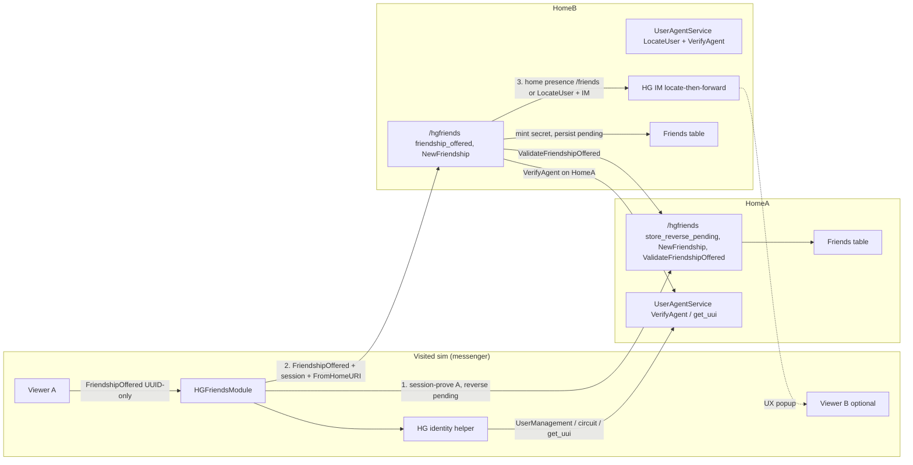

# Hypergrid Friendship Offer/Accept: Home-Canonical Pending

| Field | Value |
|---|---|
| **Author** | OpenSim-Aura (design) |
| **Date** | 2026-08-29 |
| **Status** | Draft |
| **Audience** | Senior OpenSim engineers working on Hypergrid friends, IM, and identity |
| **Scope** | HG friendship offer, accept, deny, unfriend; identity resolution reused from IM/profile |

---

## Overview

Hypergrid friendship offer and accept is unreliable because the visited sim treats a viewer popup as the offer, while canonical state is supposed to live in each avatar's home friends table. Viewer packets are UUID-only; HomeURI is reconstructed on the sim; the friendship IM path never goes through `HGMessageTransferModule`; several home-service bugs drop pending rows, skip validation, force HTTP, and make `/hgfriends` unfriend unconditionally dead.

This design makes the visited sim a **meeting place and messenger only**. Canonical pending and accepted friendship always lives at each avatar's HOME. A local popup without a home row is not an offer. Identity (HomeURI / UUI) is resolved the same way HG profiles and HG IM already do. Location (which sim, or offline) is HomeB's job via presence + `UserAgentService.LocateUser`, **delivered as a FriendshipOffered IM through the existing HG IM locate-then-forward path** — not as POST `/friends` to a gatekeeper URI. Friendship pending is the analogue of offline IM: stored at HomeB regardless of where B is.

In-world Accept is final: if B clicks Accept with a live traveling session, both homes complete immediately. There is no second "please confirm when you get home" dialog.

> **Operator callout (mixed-version).** Outgoing to an **old HomeB** degrades: still send `FromName=First.Last@host`; treat HTTP success as success. Outgoing to an **old HomeA** **fails closed** (`store_reverse_pending` is an unknown METHOD). Incoming from old grids keeps name-parse + `ValidateFriendshipOffered`. Symptom of old HomeA: A sees *"Could not reach your home grid"* — not a HomeB failure. Feature flag `HomeCanonicalOffers` **defaults false for one release** so upgrading sims+Robust does not suddenly fail offers to unupgraded HomeA grids. Incoming `/hgfriends` on Robust always understands new fields and pending-upgrade regardless of the sim flag.

---

## Background & Motivation

### Current state

Friendship offers arrive as `InstantMessageDialog.FriendshipOffered` on the sim where A is standing. `FriendsModule.OnInstantMessage` stores a reverse pending row (`StoreBackwards`) and tries to popup B (`ForwardFriendshipOffer` → `LocalFriendshipOffered` or presence forward). The bool from `ForwardFriendshipOffer` is **discarded**. Chat IMs take a different fork: `InstantMessageModule.OnInstantMessage` only handles chat-like dialogs and sends them through `HGMessageTransferModule`, which stamps HomeURI, remembers contacts, and fail-closes when the recipient home cannot be contacted.

HG overrides in `HGFriendsModule` then try to talk to foreign homes via `/hgfriends` (`HGFriendsServicesConnector` / `HGFriendsService`). That path is where the product actually fails.

### Pain points (verified in code)

| Scenario | What happens today |
|---|---|
| A and B both HG visitors, same sim | Viewer popup works (`LocalFriendshipOffered`). `StoreBackwards` is a no-op for a foreign requester. `HGFriendsModule.ForwardFriendshipOffer` calls `base.ForwardFriendshipOffer` first, which returns success on local delivery and never calls HomeB. They go home with no request. |
| Same foreign grid, different sims | On Accept, `StoreFriendships` "both foreigners" builds UUI only from circuits **in this sim**. Missing circuit → empty UUI → `NewFriendship` `ParseUniversalUserIdentifier` fails. |
| Different foreign grids | `ServiceURLs["FriendsServerURI"]` indexer throws if the key is missing. `GetUserServerURL` HomeURI-fallback exists for `HomeURI`/`IMServerURI` only, not `FriendsServerURI`. |
| A at HomeA, B at HomeB | Home-to-home `ValidateFriendshipOffered` uses `FriendsService.GetFriends(string)`, which drops every row (2022 regression). |
| Accept succeeds with session | `NewFriendship(verified=true)` stores **flags=0** ("confirm at home") and returns before the reverse-pending completion path. Connector also parses `<Result>Success</Result>` with `Boolean.TryParse` → always false. |
| B traveling (`RegionID==0`) | `HGFriendsService.ForwardToSim` stores pending, then skips delivery because `GetRegionByUUID(Zero)` is null. `LocateUser` is not wired: `HGFriendsService` never loads `IUserAgentService` even though `Robust.HG.ini.example` already has `UserAgentService = ...` under `[HGFriendsService]`. `LocateUser` returns the **gatekeeper** URI (`CreateTravelInfo` stores `GridExternalName = region.ServerURI` where `region` is copied from the gatekeeper), not a region `/friends` endpoint. |

### Root causes (verified)

1. **Viewer packets are UUID-only.** HomeURI must be reconstructed from UserManagement / circuit / `get_uui`. Friends do this poorly; IM (`StampSenderUUI`, `TryGetRecipientUUI`) and profiles (`ResolveTargetProfileURI`, `ResolveProfileURIViaRequester`) already do it well.

2. **Chat vs friendship fork immediately.** `InstantMessageModule.OnInstantMessage` ignores `FriendshipOffered` (only chat-like dialogs). Friendship never gets `HGMessageTransferModule` identity/locate/fail-closed behavior. Service-injected FriendshipOffered IMs are still usable as **UX** if `HGFriendsModule` listens to `OnIncomingInstantMessage` (multicast); InstantMessageModule's ignore does not consume the event.

3. **`HGFriendsModule.StoreBackwards` is a no-op for a foreign requester** (`HGFriendsModule.cs` ~488–511). A's home never gets the anti-spam reverse pending, so `ValidateFriendshipOffered` cannot succeed even after the GetFriends fix.

4. **Same-sim local IM delivery returns success** (`FriendsModule.ForwardFriendshipOffer` → `LocalFriendshipOffered`) and never contacts either home. `HGFriendsModule.ForwardFriendshipOffer` starts with `if (base.ForwardFriendshipOffer(...)) return true;`.

5. **`StoreFriendships` both-foreigners** only builds UUI from circuits in *this* sim. The agent-local / friend-absent branch already falls back to `m_uMan.GetUserUUI` + `GetUserServerURL`; both-foreigners does not.

6. **`ServiceURLs["FriendsServerURI"]` throws** if missing. Profiles/IM already `TryGetValue` + HomeURI fallback.

7. **`FriendsService.GetFriends(string)` parses `i.Friend` before assigning `d.Friend`**, so every row is treated as junk. Also never assigns `i.PrincipalID`. `ValidateFriendshipOffered` uses this overload.

8. **`/hgfriends` `friendship_offered` is unauthenticated.** `FromName` is caller-controlled (`First.Last@host`). `ProcessFriendshipOffered` builds `http://` from that name. `new UserAgentServiceConnector(uriStr)` is never null, so the https fallback is dead.

9. **`HGFriendsServerPostHandler.DeleteFriendship` SECRET check always returns false.** The condition is `if (request.TryGetValue("SECRET", out object tmpObj) || tmpObj is null)`: key present → short-circuit true → false; key absent → `tmpObj` is null → false. `m_TheService.DeleteFriendship` is never called. Typo `TryGetValue \|\|` instead of `!TryGetValue \|\|`. Independently, `HGFriendsModule.Delete` binds `ParseFullUniversalUserIdentifier` "url" to lastname, so even a working handler would POST unfriend to a non-URI.

10. **`DeletePreviousHGRelations` second loop reads `GetFriendsFromCache(a1)` again** instead of `a2`. Same-grid HG-to-local conversion on return home is half-broken.

11. **`NewFriendship(verified=true)` short-circuits to `StoreFriend(..., 0)`** before checking reverse pending, and **returns false if any row already exists**, so an offer-time pending row blocks accept-time completion.

12. **`FriendsSimConnector.Call` is FireAndForget and always returns true.** Even `HGFriendsServicesConnector.FriendshipOffered` (inherited) cannot fail closed.

13. **`HGFriendsService.FriendshipOffered` FireAndForgets `ProcessFriendshipOffered` and returns true** as soon as the local account exists. Caller cannot know whether validation/store happened.

14. **`HGFriendsServicesConnector.NewFriendship` cannot observe success.** Handler `SuccessResult()` emits `<Result>Success</Result>`; connector does `Boolean.TryParse("Success")` → false. Return values are ignored today.

15. **`FriendsSimpleRequestHandler.FriendshipOffered` ignores `FromName`**, looks up `UserAccountService.GetUserAccount(fromID)` (null for foreigners) → popup name `"Unknown"`. `HGFriendsModule.LocalFriendshipOffered` only seeds UserManagement when `fromAgentName` contains `@`.

---

## Goals & Non-Goals

### Goals

- Canonical pending/accepted state lives at each avatar's home. Visited sim is messenger + popup only.
- Offer fails closed if HomeA or HomeB is unreachable or rejects. A sees a failure alert. No local-only "success".
- In-world Accept with live traveling session (`SessionID` + `ServiceSessionID` / `VerifyAgent`) completes both homes immediately. No second confirm at home.
- Reuse identity + locate split already used by HG profiles and HG IM. Do not invent a third locate system. Traveler popup uses HG IM `LocateUser` → `grid_instant_message`, not POST `/friends` to a gatekeeper.
- Friendship secret minted at offer time when HomeB writes the pending row (8-hex, appended to UUI, same form as today).
- Keep `/hgfriends` POST query-string protocol. Add fields, do not add a new endpoint.
- Mixed-version HG (explicit HomeA vs HomeB):
  - *Outgoing to old HomeB:* send `FromName` + new fields; fail closed only if the HTTP call fails; HTTP success is degraded success.
  - *Outgoing to old HomeA:* fail closed (`store_reverse_pending` unknown). Symptom: *"Could not reach your home grid."*
  - *Incoming from old grids:* name-based `ProcessFriendshipOffered` + `ValidateFriendshipOffered` (once `GetFriends(string)` is fixed).
- Independently reviewable PRs, with correctness bugs first. **Home-canonical offer and accept-completes ship in the same PR** so a default-on or operator-enabled flag cannot persist pending that Accept cannot complete.

### Non-Goals

- Changing the Friends table schema (`PrincipalID` / `Friend` / `Flags`). No migration of existing rows.
- A new friendship protocol (JSON-RPC, Caps, etc.).
- Unifying IM, profile, and friends into one module. Share helpers; do not rewrite IM/profile except for the FriendsServerURI HomeURI fallback that already exists for IM. **Using HG IM as a popup transport is in scope; storing friendship state in the IM store is not.**
- HG friends *status* notifications for travelers (`RegionID==0` still skipped in `StatusNotification`). Out of scope except where LocateUser is needed for the *offer popup*.
- Viewer protocol changes. Packets stay UUID-only.
- Cross-grid groups, calling-card inventory replication, or map/find-agent for HG friends beyond what already exists.
- Replacing `TheirFlags == -1` as the pending signal (LEFT JOIN converse missing).
- Changing `LocateUser` to store `finalDestination.ServerURI` instead of the gatekeeper (would be a third locate system / traveling-data migration).

---

## Key Decisions

### Locked product decisions (do not re-open)

1. **In-world Accept is final.** If B clicks Accept and we have B's live traveling session (`SessionID` + `ServiceSessionID` / `VerifyAgent`), both homes complete the friendship immediately. No second "please confirm when you get home" dialog.

2. **Offer fails closed if HomeB is unreachable.** A local popup without a pending row on B's home is not an offer. Tell A it failed. Same fail-closed rule as IM when HomeB cannot be contacted.

3. **Do not invent a third locate system.** Reuse the identity + locate split already used by HG profiles and HG IM:
   - Identity (HomeURI) from CreatorData / UserManagement / agent circuit / requester-home `get_uui`.
   - Location (which sim, or offline) is HomeB's job via presence + `UserAgentService.LocateUser` + (for IM) offline store. Friendship pending is the analogue of offline IM: stored at HomeB regardless of where B is.
   - **Popup for travelers:** after persist, inject a `FriendshipOffered` **IM** through the same locate-then-forward path as `HGInstantMessageService` (`LocateUser` returns gatekeeper URI → `InstantMessageServiceConnector.SendInstantMessage` XML-RPC `grid_instant_message`). Do **not** POST `/friends` to that URI. `/friends` remains valid only when we have a **region** `GridRegion` from home-grid presence (`RegionID != 0`).

4. **Friendship secret is minted at offer time** when the pending row is written on HomeB (not at accept). Same 8-hex secret appended to the UUI as today (`UUID.Random().ToString().Substring(0, 8)`).

### Additional decisions (this design)

5. **Wire format stays `/hgfriends` POST `application/x-www-form-urlencoded` query string** (`ServerUtils.ParseQueryString` / `BuildQueryString`), XML `<ServerResponse>` replies. New optional fields are ignored by old grids. No new endpoint.

6. **Feature flag `[HGFriendsModule] HomeCanonicalOffers = false` for one release (safer production default).** When false, this grid's **sims** use the old outgoing path (local popup / best-effort home), still with PR1 bugfixes. When true, sims use home-canonical offer/accept and fail closed. **Incoming `/hgfriends` on Robust always accepts both old and new fields and always upgrades pending on `NewFriendship`** — the flag does not gate the home service. Operators enable the flag after HomeA grids they care about understand `store_reverse_pending`. Revisit defaulting to true in a subsequent release.

7. **Outgoing mixed-version (HomeA vs HomeB are different).**
   - Old **HomeB:** still send `FromName=First.Last@host`. Old HomeB returns true as soon as the account exists (FireAndForget). Treat HTTP success as degraded success; local-deliver the popup if B is on this sim (old HomeB will not IM-inject travelers, so no duplicate). If the HTTP call itself fails, fail closed.
   - Old **HomeA:** `store_reverse_pending` unknown METHOD → fail closed. A sees *"Could not reach your home grid."* Flip `HomeCanonicalOffers = false` to restore old outgoing behavior.

8. **Incoming from old grids: name-based fallback remains.** If `FromHomeURI` / `SESSIONID` / `KEY` are missing, new HomeB uses current `FromName` parsing + `ValidateFriendshipOffered`. Still persist pending with a minted secret. Do not require a session we cannot get from old senders.

9. **`NewFriendship` is "complete a friendship", not "create pending".** Pending is written only by `friendship_offered` (HomeB) and `store_reverse_pending` (HomeA). `NewFriendship` upgrades pending → flags=1 both directions using the **existing** secret. It must not refuse because a flags=0 row already exists, and must not store flags=0 when verified. **This upgrade ships in the same PR as home-canonical offer persist.** Independently merging persist-without-upgrade with the flag on is a user-visible Accept regression.

10. **Secret is not regenerated on accept.** `StoreFriendships` currently always mints a new 8-hex secret; that must stop when a pending UUI already carries one. HomeB looks up pending by UUID prefix; the sim may send `Friend=A` UUID-only.

11. **Popup delivery is UX-only and happens after persist, synchronously, with a bounded timeout (2s).** HomeB: home-grid presence → region `/friends` (with `FromName`); else `LocateUser` + HG IM forward. **Do not call `InstantMessageServiceConnector.SendInstantMessage` as-is** (it hardcodes `WebUtil.GetNewGlobalHttpClient(10000)`). Add an overload / timeout argument (2s) or cancel the request at 2s; timeout ⇒ `Delivered=false`, **pending still stored**, `RESULT=true`. Send the same `[Messaging] MessageKey` that `HGInstantMessageService` uses. Then return `<Delivered>true|false</Delivered>`. The visited sim local-delivers **only** when `Delivered` is missing (old HomeB) or false, **and** B is on this sim. New HomeB does not FireAndForget popup. Persist is the trust boundary; a missed popup is recovered by login replay (`TheirFlags == -1`).

12. **`friendship_offered` is synchronous** through verify → validate → mint secret → persist → bounded popup attempt. The HTTP `RESULT` reflects **store** success. `Delivered` reflects popup success. Do not return success until persist has finished.

13. **HomeB is the accept orchestrator.** Session-prove B → upgrade local pending with existing secret → parse A-UUI from that row → FriendsServerURI or HomeURI fallback → `NewFriendship` to HomeA with `B-UUI;same-secret`. Return an explicit reason: `upgraded` / `already` / `no_pending` / `homea_failed`. **`already` is idempotent success** (`RESULT=true`): do not alert B, do not roll back. **Roll back HomeB only if this call performed the flags=0→1 upgrade and HomeA then failed** (after one retry). Sim on `homea_failed`/`no_pending`: alert B, no calling card. Sim on `already`/`upgraded`: recache, calling card if not already present.

14. **HTTP `/hgfriends` only when that home is a foreign grid.** If the home is **this grid**, use this grid’s Friends/HGFriends path — standalone: in-process `FriendsService` / `HGFriendsService`; grid: the existing Robust Friends connector and/or POST `/hgfriends` to **this** Robust. Do **not** mint the canonical secret only on a visited sim that is not HomeB. Secret mint + pending persist happen on HomeB’s service (this Robust when B is a local account; foreign `/hgfriends` when B’s home is elsewhere).

15. **`/friends` on a region is unauthenticated popup injection (pre-existing).** Persist-then-popup remains the trust boundary. Do not treat a `/friends` POST as creating pending. Pass `FromName` / `FromHomeURI` through so the handler does not render `"Unknown"` or skip UserManagement seed.

---

## Proposed Design

### Canonical invariant

> The visited sim is a meeting place and messenger. Canonical pending/accepted state lives at each avatar's HOME. A popup without a home row is not an offer.

Friends table (unchanged):

| Column | Role |
|---|---|
| `PrincipalID` varchar(255) | Local UUID or HG UUI (`uuid;HomeURI;First Last[;secret]`) |
| `Friend` varchar(255) | UUID or UUI |
| `Flags` | 0 = this side pending/granted-none; 1 = `FriendRights.CanSeeOnline` (completed default) |
| `TheirFlags` | **Computed**, not stored: LEFT JOIN converse row; `-1` if missing |

Pending offer to B from A, stored at HomeB:

- `PrincipalID = B`, `Friend = A-UUI;secret`, `Flags = 0`
- No converse row → B sees `TheirFlags == -1` → outstanding offer at login (`FriendsModule.SendFriendsOnlineIfNeeded`)

Anti-spam reverse pending at HomeA:

- `PrincipalID = B` (UUID; `GetFriends(string)` LIKE prefix also matches `B-UUI`), `Friend = A` (UUID-only, matches today's `StoreBackwards`)
- `ValidateFriendshipOffered(from=A, to=B)` = `GetFriends(B)` has `Friend.StartsWith(A)` and `TheirFlags == -1`

Completed HG friendship (both homes, same secret):

- HomeB: `(B, A-UUI;secret, 1)` and `(A-UUI;secret, B, 1)`
- HomeA: `(A, B-UUI;secret, 1)` and `(B-UUI;secret, A, 1)`
- HomeA **must delete** the UUID-only reverse `(B, A, 0)` so login does not replay `FriendshipMessage` "Please confirm this friendship…". Today's unverified path already deletes that row (`HGFriendsService.cs` 148–157); keep it.

UUI form (existing): `uuid;HomeURI;First Last[;secret]`  
Produced by `Util.ProduceUserUniversalIdentifier` / `Util.UniversalIdentifier` / `GridInstantMessage.BuildUUI`.  
Parsed by `Util.ParseUniversalUserIdentifier` / `ParseFullUniversalUserIdentifier`.

Traveling session proof (existing): circuit `SessionID` + `ServiceSessionID`. Set at HG launch as `region.ServerURI + ";" + UUID.Random()` (`UserAgentService.LoginAgentToGrid`). **`region` here is a copy of the gatekeeper**, so `LocateUser` returns the visited **gatekeeper** URI. Home `VerifyAgent(sessionID, token)` compares to traveling-agent `ServiceToken`.

`get_uui(from, target)` on a home (`UserAgentService.GetUUI`): local account → `uuid;thisGrid;name`; else friends list UUI with secret stripped; else GridUser UUI (IM contacts / visitors).

### Architecture



### Identity resolution (reuse IM/profile; no third system)

Resolution order for **B's HomeURI / FriendsServerURI / UUI**, on A's current sim. Mirrors `UserProfileModule.ResolveTargetProfileURI` + `HGMessageTransferModule.TryGetRecipientUUI`:

1. **UserManagement cache** — seeded by CreatorData (`AddCreatorUser`), prior IM (`RememberContact`), visitor login, friends-list preload (`HGFriendsModule.CacheFriends`).
2. **A's circuit `HomeURI` `get_uui(A, B)`** — `UserAgentServiceConnector.GetUUI`. Covers "B is A's home friend / local account / GridUser IM contact" when B never visited this sim.
3. **Fail if unknown.** Do not guess. Do not encode home only in `First.Last@host`.

FriendsServerURI = advertised `FriendsServerURI` **or HomeURI fallback** (same pattern as `GetUserServerURL` for `IMServerURI` / `HomeURI` today). Standalone grids serve `/hgfriends` on HomeURI (`SRV_FriendsServerURI = "${Const|BaseURL}:${Const|PublicPort}"` in `StandaloneCommon.ini`).

Shared helper (PR2), used by friends, aligned with IM/profile:

```csharp
// Proposed: OpenSim.Region.CoreModules.Framework.UserManagement.HGIdentity
public static class HGIdentity
{
    // Circuit HomeURI → UserManagement.GetUserHomeURL → SceneGridInfo.GateKeeperURL for locals
    public static string ResolveHomeURI(Scene scene, IUserManagement um, UUID userId);

    // TryGetValue("FriendsServerURI") then ResolveHomeURI. Never ServiceURLs[key] indexer.
    public static string ResolveFriendsServerURI(Scene scene, IUserManagement um, UUID userId,
        AgentCircuitData circuit);

    // UserManagement.GetUserUUI → requester-home get_uui → ProduceUserUniversalIdentifier(circuit)
    public static bool TryResolveUUI(Scene scene, IUserManagement um, UUID requesterId,
        UUID targetId, out string uui);

    // Same store get_uui reads: UserManagement.AddUser + GridUser.SetLastPosition(BuildUUI)
    public static void RememberContact(Scene scene, IUserManagement um,
        UUID userId, string first, string last, string home);
}
```

`UserManagementModule.GetUserServerURL`: add `FriendsServerURI` to the existing HomeURI fallback set (`HomeURI` || `IMServerURI`). One-line behavioral fix, also needed independently of the helper.

Do **not** invent a presence/locate cache on the visited sim for B. After identity is known, HomeB locates B.

New file wiring: `OpenSim.Region.CoreModules.csproj` has `EnableDefaultItems=false`, so add an explicit `<Compile Include="Framework\UserManagement\HGIdentity.cs" />`. Root `prebuild.xml` already `<Match pattern="*.cs" recurse="true">` for CoreModules, so no prebuild glob change. Tests under `Framework/UserManagement/Tests` and `Avatar/Friends/Tests` are already globbed.

### Offer procedure

#### Control-flow checklist (must-change; fail-closed)

Today `HGFriendsModule.ForwardFriendshipOffer` starts with `base.ForwardFriendshipOffer`, which local-delivers and returns true. Today `FriendsModule.OnInstantMessage` discards that bool and never alerts.

When `HomeCanonicalOffers` is true and the offer is HG (either side not `IsLocalGridUser`), the new order is:

1. Resolve B identity (HomeURI / FriendsServerURI / UUI). Fail → alert `no_homeuri`. **Do not popup. Do not StoreBackwards on the visited grid.**
2. Session-prove A from circuit (`SessionID` + `ServiceSessionID`). Fail → alert.
3. Reverse pending on **HomeA** (this-grid Friends/HGFriends path if A’s home is this grid; else sync `store_reverse_pending` to foreign HomeA). Fail → alert `homea_unreachable`. No popup.
4. Persist pending on **HomeB** (this-grid HGFriends path if B’s home is this grid — mint secret there; else sync `friendship_offered` to foreign HomeB). Fail → `drop_reverse_pending` on HomeA, alert `homeb_unreachable` / `validate_failed` / `verify_failed`. No popup. No calling card. No local friend row. Do not mint the canonical secret on a visited sim that is not HomeB.
5. **Only then** optional local popup if HomeB `Delivered != true` **and** B is on this sim.
6. `RememberContact` both ways.

Explicitly:

- Do **not** call `base.ForwardFriendshipOffer` first (or at all) on the HG path.
- `HGFriendsModule.OnInstantMessage` must **honor false** and `SendAgentAlertMessage` with the strings below.
- Do not create a calling-card or local friends row on failure.
- Both-local (`IsLocalGridUser(A) && IsLocalGridUser(B)`) still uses `base.OnInstantMessage` / `base.StoreBackwards` / `base.ForwardFriendshipOffer`.

```mermaid
sequenceDiagram
  participant A as Viewer A
  participant Sim as Visited sim
  participant HA as HomeA
  participant HB as HomeB
  participant IM as HG IM / region
  participant B as Viewer B

  A->>Sim: FriendshipOffered (UUID B, message)
  Sim->>Sim: Resolve B HomeURI (UM / get_uui)
  Sim->>Sim: Circuit SessionID + ServiceSessionID of A
  alt identity unknown or HomeA unreachable
    Sim->>A: alert (no popup)
  else
    Sim->>HA: reverse pending (this-grid path if A local, else store_reverse_pending)
    HA->>HA: VerifyAgent(A) if foreign HTTP + StoreFriend(B, A, 0)
    Sim->>HB: friendship_offered + FromHomeURI + SESSIONID + KEY (this-grid HomeB path if B local)
    HB->>HA: verify_agent XML-RPC (new path)
    HB->>HA: validate_friendship_offered
    HB->>HB: mint 8-hex secret, StoreFriend(B, A-UUI;secret, 0)
    HB->>IM: bounded 2s: home presence /friends or LocateUser + grid_instant_message
    IM-->>B: FriendshipOffered popup (UX)
    HB-->>Sim: RESULT=true, Delivered=true/false
    opt Delivered != true and B on this sim
      Sim->>B: local popup
    end
    Sim->>Sim: RememberContact both ways
  end
```

Step-by-step:

1. **Resolve B's HomeURI** via the helper above. FriendsServerURI = advertised or HomeURI fallback. Fail if unknown.

2. **Session-prove A** from A's circuit (`SessionID`, `ServiceSessionID`). Fail if missing (should not happen for a logged-in root agent).

3. **Reverse pending on HomeA.** HTTP `/hgfriends` **only when HomeA is a foreign grid**.
   - If **A’s home is this grid** (`UserManagementModule.IsLocalGridUser(A)`): use this grid’s Friends path. Standalone: in-process `FriendsService.StoreFriend(B, A, 0)` (today’s `FriendsModule.StoreBackwards`). Grid: the existing Robust `IFriendsService` connector (same store, not a foreign `/hgfriends` POST).
   - If **A’s home is foreign**: sync `/hgfriends` `store_reverse_pending` (session-authed via HomeA `VerifyAgent`). Stores `Principal=B, Friend=A` (UUID-only). Fail the offer if HomeA unreachable or unknown METHOD.

4. **Pending on HomeB** (canonical store; fail closed). HTTP `/hgfriends` **only when HomeB is a foreign grid**. Canonical secret is minted **on HomeB’s service**, never only on a visited sim that is not HomeB.
   - If **B’s home is this grid**: this process *is* HomeB (or talks to this Robust as HomeB). Standalone: in-process `HGFriendsService`. Grid: POST `/hgfriends` to **this** Robust (or the in-process service on Robust). Still Verify/Validate against HomeA when A is foreign, mint secret, `StoreFriend(B, A-UUI;secret, 0)`. This is test matrix row 7 (foreign B offers to local A) — today’s `StoreBackwards` no-op is exactly this hole.
   - If **B’s home is foreign**: sync `friendship_offered` with explicit fields to **that** grid. **Not** home encoded only in `FromName`. If HomeB unreachable or returns failure, fail the offer (alert A), `drop_reverse_pending` on HomeA, no local-only success. The visited sim does not mint or store the canonical pending row.

5. **HomeB new-path checks (all before persist/return):**
   - Reject if `ToID` is not a local account (`UserAccountService.GetUserAccount`) when this process *is* HomeB. (Visited-grid `/hgfriends` must not be used to create pending for a visitor.)
   - New path requires `FromHomeURI` + `SESSIONID` + `KEY`.
   - **Host match (anti-spoof):** `VerifyAgent` is always called **on** `FromHomeURI` (scheme preserved) — that is not a second check. When `FromName` is present, **do not use `OSHHTPHost.Equals`**. That compares Host+Port (`GridInfo.cs` 339–346). Mixed-version `FromName=First.Last@grid.example` has no scheme/port → `OSHHTPHost` Port=**80**; `FromHomeURI=https://grid.example/` → Port=**443** → false reject of a valid https home. Match **hostname case-insensitive** only. Compare ports **only if both** original strings have an explicit **non-default** port (`:8002`, not omitted 80/443). Trailing slash ignored. **`FromName` may be omitted on the new path** if session + `FromHomeURI` are present; mixed-version outgoing still sends it so old HomeB works.

```csharp
// PR3 helper. Required test: FromName=First.Last@grid.example +
// FromHomeURI=https://grid.example/ → accept.
static bool HomeHostsMatch(string fromHomeUri, string fromName)
{
    if (string.IsNullOrWhiteSpace(fromName))
        return true;
    string nameHome = GridInstantMessage.ResolveSenderHomeURI(null, null, fromName);
    var a = new OSHHTPHost(fromHomeUri);
    var b = new OSHHTPHost(nameHome);
    if (!a.IsValidHost || !b.IsValidHost)
        return false;
    if (!string.Equals(a.Host, b.Host, StringComparison.OrdinalIgnoreCase))
        return false;
    bool aExplicit = HasExplicitNonDefaultPort(fromHomeUri);
    bool bExplicit = HasExplicitNonDefaultPort(nameHome);
    return !(aExplicit && bExplicit && a.Port != b.Port);
}
// HasExplicitNonDefaultPort: original string contains ":port" after the host
// and that port is not 80 or 443. Omitted port is not 80-vs-443.
```
   - `UserAgentServiceConnector(FromHomeURI).VerifyAgent(SESSIONID, KEY)`.
   - `HGFriendsServicesConnector(FriendsServerURI or FromHomeURI).ValidateFriendshipOffered(fromID, toID)` — true only if reverse pending exists on HomeA.
   - Mint secret; `StoreFriend(toID, fromUUI + ";" + secret, 0)`. **Always persist even if B is traveling (`RegionID=0`)**. Idempotent if a pending row for this pair already exists (reuse existing secret, do not mint a second).
   - Do **not** FireAndForget verify/store.

6. **Deliver popup if B is locatable** (UX only, **after** persist, **bounded 2s**, then set `Delivered`):

   Load existing `[HGFriendsService] UserAgentService` (`Robust.HG.ini.example` already has the key; the constructor currently ignores it). Do not invent a new config key.

   | B location | How we know | Transport |
   |---|---|---|
   | On a **home-grid region** (`PresenceService.GetAgents`, `RegionID != 0`) | `GridService.GetRegionByUUID` → `GridRegion.ServerURI` is the **sim** | POST `/friends` `friendship_offered` with **FromName** (and FromHomeURI if we add it). Standalone: `m_FriendsLocalSimConnector.LocalFriendshipOffered`. `/friends` is unauthenticated popup injection (pre-existing). |
   | Traveling | `IUserAgentService.LocateUser(toID)` → **gatekeeper** URI | FriendshipOffered **IM** via the same XML-RPC `grid_instant_message` path as `HGInstantMessageService.ForwardIMToGrid`. **Do not call `InstantMessageServiceConnector.SendInstantMessage(url, im, messageKey)` as-is** — it uses `WebUtil.GetNewGlobalHttpClient(10000)` and would block persist+10s on the visited sim’s sync `/hgfriends` call. Add an overload with timeout (2s) or wrap with cancellation; on timeout or false, `Delivered=false`. Pass **`[Messaging] MessageKey`**, the same string `HGInstantMessageService` loads (`HGInstantMessageService.cs` ~129). Robust `InstantMessageServerConnector` does **not** check the key; **region** `MessageTransferModule` rejects if `MessageKey` is set and the request key is missing/mismatched. If IM between those grids already works, popup works; otherwise `Delivered=false`. `GridInstantMessage` dialog=`FriendshipOffered`, `fromAgentHomeURI` set, `fromAgentName` display name, `imSessionID = fromAgentID` (existing hack). |
   | Offline / locate fail | — | `Delivered=false`. Pending stays; login replays outstanding (`TheirFlags == -1`). |

   On the destination **region**, `HGMessageTransferModule.SendIMToScene` fires `TriggerIncomingInstantMessage`. `InstantMessageModule` ignores `FriendshipOffered` (viewer-originated chat filter). **`HGFriendsModule` must subscribe to `OnIncomingInstantMessage`** and, for `FriendshipOffered` / `FriendshipAccepted` / `FriendshipDeclined`, call `LocalFriendshipOffered` / `LocalFriendshipApproved` / `LocalFriendshipDenied` **popup only** — no `StoreBackwards`, no home writes. `RememberContact` from `fromAgentHomeURI`.

   Timeout: **2 seconds** for locate + inject, enforced on the HTTP client / wait, not by hoping the 10s helper returns sooner. Timeout ⇒ `Delivered=false`, **`RESULT` still true** (pending stored). Then return. Do not FireAndForget a second inject.

7. **Stamp/remember contacts** like IM (`RememberContact`). Use `FromHomeURI` and B's resolved home, not `http://` + display name.

Failure alert to A (reuse existing `SendAgentAlertMessage` style):

- `"Unable to send friendship invitation. Could not reach the destination home grid."` (HomeB down / HTTP fail)
- `"Unable to send friendship invitation. Could not reach your home grid."` (HomeA down **or old HomeA unknown METHOD**)
- `"Unable to send friendship invitation. User identity could not be resolved."` (no HomeURI)
- Existing: `"Unable to send friendship invitation to foreigner. Insufficient permissions."` (`LevelHGFriends`)
- Existing: `"This person is already your friend..."`

### Accept procedure

HomeB is the orchestrator. B's current sim often does **not** have A's circuit. After offer, HomeB **does** have the pending UUI; `ParseUniversalUserIdentifier` of a 36-char UUID still yields the UUID, so the sim may send `Friend=A` UUID-only and HomeB looks up pending by prefix.

```mermaid
sequenceDiagram
  participant B as Viewer B
  participant Sim as B's current sim
  participant HB as HomeB
  participant HA as HomeA
  participant A as Viewer A

  B->>Sim: Accept (UUID A)
  Sim->>Sim: Session-prove B
  Sim->>HB: newfriendship verified (Principal=B, Friend=A UUID or UUI)
  HB->>HB: find pending by UUID prefix
  alt already flags=1 both ways
    HB->>HA: newfriendship unverified (idempotent; do not rollback HomeB)
    HB-->>Sim: RESULT=true reason=already
    Sim->>Sim: RecacheFriends, calling card if needed
  else no pending
    HB-->>Sim: RESULT=false reason=no_pending
    Sim->>B: alert, no calling card
  else pending flags=0
    HB->>HB: upgrade local flags=1 both directions (reason=upgraded)
    HB->>HA: newfriendship unverified (Principal=A, Friend=B-UUI;same-secret)
    alt HomeA fails after retry
      HB->>HB: rollback to pending (this call upgraded)
      HB-->>Sim: RESULT=false reason=homea_failed
      Sim->>B: alert, no calling card
    else HomeA ok
      HA->>HA: delete UUID-only reverse, flags=1 both directions
      HA-->>A: FriendshipApproved if A online
      HB-->>Sim: RESULT=true reason=upgraded
      Sim->>Sim: RecacheFriends, calling card, notify A if local
    end
  end
```

If B already clicked Accept and we have B's live session:

1. Session-prove B (`SessionID` + `ServiceSessionID`). Local home session (B at HomeB): `VerifyServiceKey` may fail (no traveling token); use this grid’s Friends/HGFriends path / `NewFriendship(verified=false)` reverse-pending — B is on their home, the pending row *is* the auth.
2. Sim → HomeB `newfriendship` with `Principal=B`, `Friend=A` (UUID-only allowed). **Do not require A's UUI from this sim.**
3. **HomeB** finds `GetFriends(B)` where `Friend.StartsWith(A)` and returns an explicit reason (`upgraded` / `already` / `no_pending` / `homea_failed`):
   - None → `no_pending`, `RESULT=false`.
   - `MyFlags != 0` **and** a converse row exists (`TheirFlags != -1`) → **`already`**, **`RESULT=true` (idempotent success)**. Do not delete flags=1 rows. Still **best-effort** notify HomeA (idempotent there too) so a one-sided HomeA pending can complete; **do not roll back HomeB** if that HomeA call fails.
   - Else this is pending: **reuse `pending.Friend` as the exact A-UUI;secret string**. Do not mint a new secret. Proceed as `upgraded`.
4. Upgrade HomeB **only on the pending path**: delete pending by the **exact** Friend string; delete converse if any by that same string; delete any UUID-only leftover; `StoreFriend(B, A-UUI;secret, 1)` and `StoreFriend(A-UUI;secret, B, 1)`.
5. Parse `url` from that A-UUI. FriendsServerURI = A's advertised or **HomeURI fallback**. Build `B-UUI;same-secret` via `Util.UniversalIdentifier(B, local first, last, this grid HomeURI) + ";" + secret`.
6. Call HomeA `NewFriendship` **unverified** (no B session on HomeA). Reverse pending is the auth. Retry **once** on transport/false.
7. **Rollback HomeB only if this call’s reason is `upgraded` and HomeA still failed:** restore `StoreFriend(B, A-UUI;secret, 0)` and delete the flags=1 converse. Return `homea_failed`. Pending intact (same secret). Never roll back on `already`.
8. If HomeA succeeds: HomeA deletes UUID-only reverse `(B, A, 0)` (today's unverified path), stores flags=1 both directions with `B-UUI;secret`, `ForwardToSim("ApproveFriendshipRequest")` if A is online on the home grid (region `/friends` / local connector — A is a local account there).
9. Sim: `already` and `upgraded` → `RecacheFriends`, calling card (skip create if already friends), `LocalFriendshipApproved` if A is here. `homea_failed` / `no_pending` → **alert B**, **do not** create a calling card, **do not** `StoreFriendships` locally as completed. `AddFriendship` / `OnApproveFriendRequest` must branch on the home result **and treat `already` as success**.

`HGFriendsServicesConnector.NewFriendship` must observe success (PR1): parse `RESULT`/`Result` as True/true/Success. Handler `newfriendship` should use `BoolResult` like the other `/hgfriends` methods (`<RESULT>True</RESULT>`).

If B was offline and never clicked: pending stays at HomeB; login still replays outstanding (`TheirFlags == -1`) and Accept then completes as above.

**Same home grid, both visiting elsewhere** (2016 same-grid confirm case): on Accept, `DeletePreviousHGRelations` (fixed) drops the HG UUI rows, then `base.StoreFriendships` writes local UUID↔UUID flags=`CanSeeOnline`. If they accept while still abroad, completion at the (same) home should detect same-grid UUI and store local UUID friendship, or convert on return home via the fixed `DeletePreviousHGRelations`. Prefer convert at completion time when `IsLocalGridUser` is true for both at that home.

### Deny / terminate (in-world)

Deny of a pending offer:

- Session-prove B.
- HomeB deletes its pending row for A (owner + session; no secret required to delete *own* pending).
- HomeB notifies HomeA to drop reverse pending only if `TheirFlags == -1` for that pair (`drop_reverse_pending`). This is not friendship-injection (cannot create flags=1). Acceptable residual risk: a third party who can POST to HomeA can cancel a pending offer; they cannot complete one.

Unfriend of a completed HG friendship: existing secret path, after the SECRET parser fix **and** the `ParseFullUniversalUserIdentifier` out-param fix (both required; each independently makes unfriend dead).

### `NewFriendship` semantics (Home)

Replace the verified short-circuit. No `FindByUuidPrefix` / `HasReversePending` helpers — explicit loops matching today's code. Converse delete uses the **exact** stored Friend string. Local completion returns a reason the orchestrator can switch on:

```csharp
enum FriendshipCompleteReason { Upgraded, Already, NoPending }

// Handler / connector: RESULT=true for Upgraded and Already; false for NoPending.
FriendshipCompleteReason TryCompleteLocal(FriendInfo friend, bool verified,
    out string pendingFriendExact)
{
    pendingFriendExact = null;
    if (!Util.ParseUniversalUserIdentifier(friend.Friend, out UUID friendID,
            out string url, out string first, out string last, out string reqSecret))
        return FriendshipCompleteReason.NoPending;

    FriendInfo[] mine = m_FriendsService.GetFriends(friend.PrincipalID);
    FriendInfo existing = null;
    foreach (FriendInfo fi in mine)
    {
        if (fi.Friend != null && fi.Friend.StartsWith(friendID.ToString()))
        {
            existing = fi;
            break;
        }
    }

    // Completed both ways → idempotent success. Do not delete flags=1 rows.
    if (existing != null && existing.MyFlags != 0 && existing.TheirFlags != -1)
    {
        pendingFriendExact = existing.Friend;
        return FriendshipCompleteReason.Already;
    }

    FriendInfo[] theirs = m_FriendsService.GetFriends(friendID.ToString());
    FriendInfo reverse = null;
    foreach (FriendInfo fi in theirs)
    {
        if (fi.Friend != null && fi.Friend.StartsWith(friend.PrincipalID.ToString())
                && fi.TheirFlags == -1)
        {
            reverse = fi;
            break;
        }
    }

    bool myPending = existing != null && existing.TheirFlags == -1;
    if (!myPending && reverse == null)
        return FriendshipCompleteReason.NoPending;

    string uui = existing != null && existing.Friend.Length > 36
        ? existing.Friend
        : (friend.Friend.Length > 36 ? friend.Friend : existing?.Friend);
    if (string.IsNullOrEmpty(uui))
        return FriendshipCompleteReason.NoPending;
    if (uui.Length > 36 && !string.IsNullOrEmpty(reqSecret) && !uui.EndsWith(reqSecret)
            && existing != null && existing.Friend.Length > 36)
        uui = existing.Friend;
    pendingFriendExact = uui;

    if (existing != null)
    {
        m_FriendsService.Delete(friend.PrincipalID, existing.Friend);
        m_FriendsService.Delete(existing.Friend, friend.PrincipalID.ToString());
    }
    if (reverse != null)
    {
        m_FriendsService.Delete(friendID, reverse.Friend);
        m_FriendsService.Delete(reverse.Friend, friendID.ToString());
    }

    m_FriendsService.StoreFriend(friend.PrincipalID.ToString(), uui, 1);
    m_FriendsService.StoreFriend(uui, friend.PrincipalID.ToString(), 1);

    if (reverse != null)
        ForwardToSim("ApproveFriendshipRequest", friendID,
            Util.UniversalName(first, last, url), "", friend.PrincipalID, "");
    return FriendshipCompleteReason.Upgraded;
}
```

HomeB accept **orchestrator** (must distinguish reasons):

1. `r = TryCompleteLocal(...)`.
2. `NoPending` → HTTP `RESULT=false`, reason `no_pending`. No rollback.
3. `Already` → best-effort HomeA `NewFriendship` (so HomeA pending can still complete); **never rollback HomeB**; HTTP `RESULT=true`, reason `already`. Second Accept / double-click is success; flags=1 rows stay.
4. `Upgraded` → HomeA `NewFriendship` with `B-UUI;secret`; retry once. On HomeA failure: delete the flags=1 pair **this call wrote**; `StoreFriend(B, pendingFriendExact, 0)`; HTTP `RESULT=false`, reason `homea_failed`.
5. Wire: `<RESULT>True|False</RESULT><Reason>upgraded|already|no_pending|homea_failed</Reason>`. Connector treats `already` and `upgraded` as success. Sim alerts only on `no_pending` / `homea_failed`.

This removes the "already exists → false" trap (which rolled back or alerted on double Accept) and "verified → flags=0".

### Auth / anti-spam

| Method | Auth |
|---|---|
| `friendship_offered` | New path: require `SESSIONID`+`KEY`+`FromHomeURI`. Recipient home calls A's home `verify_agent` **on FromHomeURI**. When `FromName` is present, hostname match (case-insensitive); ports only if **both** have an explicit non-default port. **Not** `OSHHTPHost.Equals` (80 vs 443). Then `ValidateFriendshipOffered`. Old path (missing new fields): `FromName` parse + `ValidateFriendshipOffered` only. |
| `store_reverse_pending` | HomeA `VerifyAgent` on **A's** session. Stores Principal=ToID, Friend=FromID, flags=0. |
| `validate_friendship_offered` | Unauthenticated (as today). True **only** if pending reverse exists on this home (`GetFriends(toID)` Friend starts with fromID, `TheirFlags == -1`). Harmless yes/no. |
| `newfriendship` | Keep session verify (`VerifyServiceKey`). Completion of existing pending / reverse pending only. Never flags=0. Unverified allowed only when reverse pending exists (HomeB→HomeA). |
| `drop_reverse_pending` | Deletes only `TheirFlags == -1` row for the pair. No completed-friendship delete. |
| `deletefriendship` | Keep secret; **handler currently never runs the service** — fix `!TryGetValue`. |
| `getfriendperms` / `statusnotification` | Unchanged (session / secret-in-UUI as today). |

`VerifyServiceKey` today uses **this** grid's `IUserAgentService.VerifyAgent`. That only works when the session belongs to **this** grid's traveling user. `friendship_offered` on HomeB cannot use it for A's session; HomeB must call **A's** `UserAgentServiceConnector.VerifyAgent`. `store_reverse_pending` and B-originated `newfriendship` on HomeB **can** use local `VerifyServiceKey`.

### Wire format

Keep POST `/hgfriends` query string. Old grids ignore unknown keys.

**`friendship_offered` request (new fields optional):**

| Field | Required (new path) | Notes |
|---|---|---|
| `METHOD` | yes | `friendship_offered` |
| `FromID` | yes | A's UUID |
| `ToID` | yes | B's UUID |
| `Message` | no | offer text |
| `FromName` | optional on new path; **send always for mixed-version** | `First.Last@host`. If present, host must match `FromHomeURI`. |
| `FromHomeURI` | yes on new HomeB | e.g. `https://grid.example:8002/` — **scheme preserved**, no forced `http://` |
| `FromFirst` | no | `First` |
| `FromLast` | no | `Last` |
| `SESSIONID` | yes on new HomeB | A's `SessionID` |
| `KEY` | yes on new HomeB | A's `ServiceSessionID` |

**`friendship_offered` response (new HomeB), after persist + 2s popup attempt:**

```xml
<ServerResponse>
  <RESULT>True</RESULT>
  <Delivered>True</Delivered>
</ServerResponse>
```

`RESULT` = persist success. `Delivered` = popup success. Old HomeB: `<RESULT>True</RESULT>` only (`BoolResult`). Missing `Delivered` → visited sim may local-popup if B is here.

**`store_reverse_pending` request (new):**

| Field | Notes |
|---|---|
| `METHOD` | `store_reverse_pending` |
| `FromID` | A |
| `ToID` | B |
| `SESSIONID` / `KEY` | A's session, verified on HomeA |
| `FromUUI` | optional; default `FromID` string |

Unknown METHOD on old HomeA → Failure → this grid's outgoing fail closed (unless flag is false). When A is local we do not need this METHOD.

**`newfriendship`:** existing `PrincipalID`, `Friend` (UUID or full UUI with secret), `SESSIONID`, `KEY`. Handler returns `RESULT=True/False` plus `<Reason>upgraded|already|no_pending|homea_failed</Reason>`. `already` and `upgraded` are success (`RESULT=True`). Connector accepts `RESULT`/`Result` in `{True, true, Success}` and must not treat `already` as failure.

**Region `/friends` `friendship_offered` (popup only):** existing `FromID`, `ToID`, `Message`, `FromName`. Handler **must use `FromName` when present** instead of local `UserAccount`. Optional `FromHomeURI` so `LocalFriendshipOffered` can `AddUser` without guessing `http://`.

### HTTPS / HomeURI handling

Stop forcing `http://`:

- `HGFriendsService.ProcessFriendshipOffered` currently `uriStr = "http://" + parts[1]`. Use `OSHHTPHost` / `GridInstantMessage.ResolveSenderHomeURI` so https homes stay https. The `uasConn is null` branch is dead (`new UserAgentServiceConnector` never returns null) — delete it; if the URI has no scheme and HTTP `GetServerURLs` throws, retry https **once**.
- `HGFriendsModule.LocalFriendshipOffered` `AddUser(..., "http://" + parts[1])` — use `im.fromAgentHomeURI` when present, else `ResolveSenderHomeURI`. Pair with the `/friends` handler passing `FromName` / `FromHomeURI`.
- Connector URLs: `TryGetValue` + `OSHHTPHost.URI` (preserves scheme). Never `ServiceURLs["FriendsServerURI"].ToString()` indexer.

### Must-fix bugs (independently reviewable, PR1)

These do not change protocol. They are production bugs today.

1. **Restore `FriendsService.GetFriends(string)`** so it uses `d.Friend` / `d.PrincipalID`. Current code parses empty `i.Friend` and `continue`s every row; never sets `PrincipalID`. This is the 2022 regression that kills `ValidateFriendshipOffered`.

```66:84:OpenSim/Services/Friends/FriendsService.cs
        public virtual FriendInfo[] GetFriends(string PrincipalID)
        {
            FriendsData[] data = m_Database.GetFriends(PrincipalID);
            // parses i.Friend before assigning d.Friend; drops every row
```

Required assignment (LIKE `uuid%` can return `PrincipalID=B-UUI;...`; `new UUID(d.PrincipalID)` would throw):

```csharp
foreach (FriendsData d in data)
{
    FriendInfo i = new FriendInfo();
    i.Friend = d.Friend;
    if (string.IsNullOrEmpty(i.Friend)
            || !Util.ParseUniversalUserIdentifier(i.Friend, out UUID _))
        continue; // junk / empty Friend; UUID-only (len 36) is valid
    if (d.PrincipalID != null && d.PrincipalID.Length >= 36
            && UUID.TryParse(d.PrincipalID.AsSpan(0, 36), out UUID pid))
        i.PrincipalID = pid;
    i.MyFlags = Convert.ToInt32(d.Data["Flags"]);
    i.TheirFlags = Convert.ToInt32(d.Data["TheirFlags"]);
    info.Add(i);
}
```

Test a row whose `PrincipalID` is a full UUI and whose `Friend` is a UUID-only reverse pending.

2. **`GetUserServerURL` HomeURI fallback for `FriendsServerURI`**, and `StoreFriendships` / `ForwardFriendshipOffer` `TryGetValue` + fallback. Mirror the `IMServerURI` branches at `UserManagementModule.cs` ~843 and ~887.

3. **PR1 does not change `StoreBackwards`.** The no-op for foreign requesters stays until the home-canonical PR. PR1 only stops the `ServiceURLs["FriendsServerURI"]` **throw** inside `StoreFriendships` (`TryGetValue` + UM fallback). Writing foreign reverse-pending into the **visited** grid's friends table would violate the canonical invariant.

4. **`StoreFriendships` both-foreigners:** if the other circuit is missing, resolve UUI + friends URL via UserManagement / `get_uui` (already done in the agent-local / friend-absent branch at ~573–603).

5. **Stop forcing `http://`** in `ProcessFriendshipOffered` and `LocalFriendshipOffered` `AddUser`. Pass `FromName` through `FriendsSimpleRequestHandler.FriendshipOffered` (use it when present; keep account lookup as fallback for local fromIDs).

6. **Fix `DeleteFriendship` SECRET check** — it **always returns false**; `DeleteFriendship` on the service is never called:

```178:185:OpenSim/Server/Handlers/Hypergrid/HGFriendsServerPostHandler.cs
        byte[] DeleteFriendship(Dictionary<string, object> request)
        {
            if (request.TryGetValue("SECRET", out object tmpObj) || tmpObj is null)
                return BoolResult(false);
```

Must be `if (!request.TryGetValue("SECRET", out object tmpObj) || tmpObj is null)`.

7. **Fix `DeletePreviousHGRelations` second loop** (`GetFriendsFromCache(a2)`, not `a1`). First loop deletes a1's pending HG rows for a2; second loop is supposed to delete a2's pending HG rows for a1.

8. **`NewFriendship` reply/connector.** Handler currently `SuccessResult()` → `<Result>Success</Result>`. Connector `Boolean.TryParse` that as bool → always false. Switch handler to `BoolResult`; connector accepts `RESULT`/`Result` in `{True,true,Success}`. Needed before fail-closed accept. **Do not change flags=0 / already-exists behavior in PR1** — that is the home-canonical PR.

9. **`HGFriendsModule.Delete` out-param order.** Signature is `(value, out uuid, out url, out first, out last, out secret)`. Call site binds the 4th string to `url`, which is **lastname**. Secret (5th) is correct. Fix: `out uuid, out url, out first, out last, out secret`. Both this and the SECRET handler bug independently make HG unfriend dead; both are PR1.

### Feature flag

```ini
[HGFriendsModule]
    ; User level required to send HG friendship invitations
    ;LevelHGFriends = 0

    ; Home-canonical HG offers. Default false for one release: OpenSim HG is
    ; mixed-version, and store_reverse_pending is unknown on old HomeA (outgoing
    ; fail closed; A sees "Could not reach your home grid"). Old HomeB still
    ; works via FromName. Incoming /hgfriends on Robust always understands new
    ; fields and NewFriendship pending-upgrade regardless of this flag.
    ; Set true when HomeA grids you offer into have been upgraded.
    HomeCanonicalOffers = false
```

Read in `HGFriendsModule.InitModule` next to `LevelHGFriends`. Robust `HGFriendsService` does **not** read this flag for incoming verify/store/upgrade.

---

## API / Interface Changes

### `IHGFriendsService` (`OpenSim/Services/Interfaces/IHypergridServices.cs`)

```csharp
public interface IHGFriendsService
{
    int GetFriendPerms(UUID userID, UUID friendID);
    bool NewFriendship(FriendInfo finfo, bool verified);
    bool DeleteFriendship(FriendInfo finfo, string secret);
    bool FriendshipOffered(UUID from, string fromName, UUID to, string message);
    bool FriendshipOffered(HGFriendshipOffer offer, out bool delivered);
    bool StoreReversePending(UUID fromId, UUID toId, string fromUui);
    bool DropReversePending(UUID fromId, UUID toId);
    bool ValidateFriendshipOffered(UUID fromID, UUID toID);
    List<UUID> StatusNotification(List<string> friends, UUID userID, bool online);
}

public class HGFriendshipOffer
{
    public UUID FromID;
    public UUID ToID;
    public string Message;
    public string FromName;      // mixed-version; optional on new path
    public string FromHomeURI;
    public string FromFirst;
    public string FromLast;
    public UUID SessionID;
    public string ServiceKey;
    public bool HasSessionProof => SessionID.IsNotZero() && !string.IsNullOrEmpty(ServiceKey)
                                   && !string.IsNullOrWhiteSpace(FromHomeURI);
}
```

Keep the old `FriendshipOffered(UUID, string, UUID, string)` as a wrapper that fills `FromName` only (incoming old grids).

`HGFriendsService` constructor **loads** `[HGFriendsService] UserAgentService` (key already in `bin/Robust.HG.ini.example` and must stay). Also load `[Messaging] MessageKey` — the **same** key `HGInstantMessageService` uses (`cnf.GetString("MessageKey", string.Empty)`). Pass it on traveler popup IM. Do not invent a new UserAgentService config key.

`InstantMessageServiceConnector`: add `SendInstantMessage(string url, GridInstantMessage im, string messageKey, int timeoutMs)` (or cancel the existing 10s client). Friendship popup calls it with **2000**. Timeout / false → `Delivered=false`; do not use the 10s helper as-is.

### `HGFriendsServicesConnector`

Add **synchronous** methods (do not reuse `FriendsSimConnector.Call`, which FireAndForgets and always returns true):

```csharp
public bool FriendshipOffered(UUID fromId, UUID toId, string message, string fromName,
    string fromHomeURI, string fromFirst, string fromLast,
    UUID sessionId, string serviceKey, out bool delivered);

public bool StoreReversePending(UUID fromId, UUID toId, string fromUui,
    UUID sessionId, string serviceKey);

public bool DropReversePending(UUID fromId, UUID toId);
```

Fix `NewFriendship` reply parsing (PR1). `DeleteFriendship` / `ValidateFriendshipOffered` stay synchronous.

### `HGFriendsServerPostHandler`

- `friendship_offered`: parse new fields; if `HasSessionProof`, call new overload; else old path.
- `store_reverse_pending` / `drop_reverse_pending`: new cases.
- `deletefriendship`: fix SECRET check (always-false).
- `newfriendship`: `BoolResult`; service behavior (pending upgrade) in the home-canonical PR.

### `FriendsSimpleRequestHandler`

- `friendship_offered`: if `FromName` present, use it; else account lookup. Optional `FromHomeURI` copied onto `GridInstantMessage.fromAgentHomeURI`. Popup only.

### `IUserManagement` / `UserManagementModule`

No interface change required if `FriendsServerURI` is added to the existing HomeURI fallback inside `GetUserServerURL`. Helper class can live beside the module without expanding the interface in PR2.

### `HGFriendsModule` incoming IM

Subscribe to `scene.EventManager.OnIncomingInstantMessage`. For friendship dialogs, popup-only `LocalFriendship*` + `RememberContact`. Do not treat incoming IM as a new offer to persist.

### Local both-local path

Unchanged. `HGFriendsModule` still calls `base.StoreBackwards` / `base.StoreFriendships` when `IsLocalGridUser(agent)` && `IsLocalGridUser(friend)`.

### `AddFriendship` / `OnApproveFriendRequest`

If home completion is `homea_failed` or `no_pending`: `SendAgentAlertMessage` to B, skip calling card, skip treating the pair as friends in cache. Leave pending intact. If `already` or `upgraded`: success (recache; calling card if not already present). Do not treat `already` as failure.

---

## Data Model Changes

**None.** `Friends` table stays:

```sql
PrincipalID varchar(255), Friend varchar(255), Flags varchar(16), Offered varchar(32)
PRIMARY KEY (PrincipalID(36), Friend(36))  -- MySQL prefix PK
```

`TheirFlags` remains a LEFT JOIN computation (`MySQLFriendsData.GetFriends`). Missing converse ⇒ `-1` ⇒ pending.

No migration of existing rows. Behavior change only:

- flags=0 + missing converse still means pending (login replay).
- New completions write flags=1 both directions instead of flags=0 one direction.
- Existing flags=0 "please confirm at home" rows from the old verified path remain pending and can still be accepted at home (TheirFlags==-1). That is the desired recovery for offers that already happened.

**SQLite note (out of scope):** `FriendsStore.migrations` uses `PrincipalID CHAR(36)`, which truncates UUI principals. MySQL/PGSQL are `varchar(255)`. Standalone SQLite HG friends with UUI PrincipalIDs were already broken; do not block this work on a SQLite migration.

---

## Security & Privacy Considerations

| Threat | Severity | Mitigation |
|---|---|---|
| Unauthenticated `friendship_offered` injects a pending offer (today: `FromName` spoof) | High | New path requires A's session + HomeB calls HomeA `VerifyAgent` on `FromHomeURI` + `ValidateFriendshipOffered`. When `FromName` present, host must match `FromHomeURI`. |
| Session stolen while A is traveling | Medium | Same as other HG operations (`getfriendperms`, `newfriendship`). Token is `ServiceSessionID` bound to this travel. Existing model. |
| Old-grid incoming still name-based | Medium | Still requires reverse pending on A's home (`ValidateFriendshipOffered`). After GetFriends(string) fix this is a real check. Without reverse pending, drop. |
| `validate_friendship_offered` unauthenticated | Low | Boolean existence of reverse pending. No PII beyond yes/no. |
| `drop_reverse_pending` cancels someone else's offer | Low | Only deletes `TheirFlags==-1`. Cannot create or complete a friendship. |
| Secret brute force (8 hex = 32 bits) | Medium (pre-existing) | Unchanged. Do not lengthen secret in this work (wire/compat). Rate-limit is whatever Robust already does on HTTP. |
| `FromHomeURI` SSRF to internal hosts | Medium | Reuse `OSHHTPHost` / existing UserAgent connector URL validation. Do not add a new HTTP client. |
| Host mismatch (`FromHomeURI` vs `FromName` `@host`) | High if skipped | Hostname case-insensitive match. Do **not** `OSHHTPHost.Equals` (https default port 443 vs FromName Port=80). Compare ports only if both strings have an explicit non-default port. VerifyAgent always against `FromHomeURI`. |
| Unauthenticated region `/friends` popup | Medium (pre-existing) | Persist is the trust boundary. Popup does not create pending. |
| Double-complete / race | Low | `NewFriendship` no-ops if converse exists (`TheirFlags != -1`). Pending upgrade is idempotent. HomeA fail → HomeB rollback to pending. |
| Local-only popup as a fake offer | High (today's bug) | Fail closed: no popup unless HomeB store succeeded (or old HomeB HTTP success + local fallback). |
| One-sided complete if HomeA down at accept | High if skipped | Retry once, then roll back HomeB **only if this call upgraded** flags=0→1; alert B; no calling card. `already` is success; never un-complete. |

Privacy: we store the same UUI (home + name) already stored for HG friends and IM contacts. `RememberContact` writes GridUser last-position with dummy vectors, same as IM.

---

## Observability

Log prefix: `[HGFRIENDS]` on service/handler, `[HGFRIENDS MODULE]` on the sim (already used).

At each offer/validate/store/accept, log:

- `from={uuid} to={uuid} fromHome={uri} toHome={uri} verified={yes/no} result={ok/fail} reason={...}`
- Fail / complete reasons (stable tokens): `no_homeuri`, `homea_unreachable`, `homeb_unreachable`, `verify_failed`, `validate_failed`, `host_mismatch`, `not_local_user`, `no_pending`, `secret_missing`, `homea_failed`. Success reasons: `upgraded`, `already` (idempotent; not a failure).
- Whether pending was written: `pending_stored home={uri} principal={uuid}`.
- Popup: `delivered={local_friends|home_presence|im_locate|none}`.
- Accept: `rollback={yes/no}` if HomeA complete failed.

Enough to diagnose **"pending missing at home"** from a single offer: one line on the sim (`offer start`), one on HomeA (`reverse_pending`), one on HomeB (`pending_stored` or `validate_failed`).

Do not log `KEY` / `ServiceSessionID` / secret at Info. Debug may log session UUID (not token).

No new metrics backend (OpenSim does not have a standard one here). Optional: existing log4net WARN on fail-closed is the alert.

---

## Rollout Plan

1. **PR1 bugfixes** — ship first, no flag needed, no protocol change. Restores home-to-home validation, unfriend (SECRET + url out-param), https, FriendsServerURI fallback, NewFriendship Result parse. **Does not change `StoreBackwards` or `NewFriendship` flags.** Safe on mixed grids.

2. **PR2 identity helper** — behavior-neutral except FriendsServerURI fallback (if not in PR1). Can ship dark. Add `HGIdentity.cs` to `OpenSim.Region.CoreModules.csproj`.

3. **PR3 home-canonical offer **and** accept-completes (one merge).** Robust incoming: new fields, sync persist, `NewFriendship` pending-upgrade, HomeB→HomeA complete + rollback, IM locate popup, load `UserAgentService`. Sims: `HomeCanonicalOffers` **default false**. Incoming old offers still work. Outgoing stays old until the operator sets the flag. **Not safe to enable the flag without this PR's `NewFriendship` upgrade** — that is why offer persist and accept-completes are not split.

4. **PR4 tests remaining, logging polish, docs** (`GridCommon.ini.example`, `StandaloneCommon.ini.example`, `Robust.HG.ini.example` comments). Service-level tests for persist + `NewFriendship` live **in PR3**, not here.

**Rollback:** keep or set `HomeCanonicalOffers = false` on sims. Robust incoming path stays compatible. No DB rollback. In-flight pending rows remain valid (flags=0, TheirFlags=-1).

**Staged rollout:** Robust (Home) first (understands new fields + NewFriendship completion), then sims, then operators flip the flag when peer HomeA grids are upgraded. A new sim with flag true talking to old HomeB uses degraded FromName path; talking to old HomeA fails closed.

---

## Testing

Existing local-only tests: `OpenSim/Region/CoreModules/Avatar/Friends/Tests/FriendModuleTests.cs` (Null friends store, same-sim). Extend; add service-level tests with `NullFriendsData`. **Tests ship in the PR that introduces the behavior**, not a later polish PR.

### Automated (NUnit) — by PR

**PR1**

| Test | Where |
|---|---|
| `GetFriends(string)` returns UUID Friend and UUI Friend rows; does not drop all; sets PrincipalID from UUID prefix | `FriendsService` + `NullFriendsData` |
| `GetFriends(string)` still skips empty Friend | same |
| `GetFriends(string)` PrincipalID is a full UUI (`uuid;http://…;Name`) does not throw; PrincipalID UUID prefix assigned | same |
| `DeleteFriendship` handler returns false without SECRET and when SECRET present-but-empty; with matching secret calls the service | `HGFriendsServerPostHandler` |
| `NewFriendship` connector/handler: `RESULT=True` and legacy `Result=Success` both parse as success | connector unit |
| HTTPS HomeURI not rewritten to http | `ProcessFriendshipOffered` / `OSHHTPHost` |
| `DeletePreviousHGRelations` deletes both a1 and a2 pending HG rows | `HGFriendsModule` with cached friends |
| `FriendsSimpleRequestHandler` uses `FromName` when present | handler |

**PR2**

| Test | Where |
|---|---|
| Identity helper: circuit vs UM vs get_uui order; fail if unknown | `HGIdentity` / `HGUserManagementModuleTests` |
| `GetUserServerURL(..., "FriendsServerURI")` falls back to HomeURL | `UserManagementModule` |

**PR3 (offer + accept)**

| Test | Where |
|---|---|
| `ValidateFriendshipOffered` true iff reverse pending exists | `HGFriendsService` |
| Sync `FriendshipOffered` with session persists `Principal=B, Friend=A-UUI;secret, Flags=0` even if presence RegionID=0 | `HGFriendsService` |
| `FriendshipOffered` without session on new path rejected; old FromName path still validates | handler + service |
| Host mismatch FromName vs FromHomeURI rejected | service |
| Host match: `FromName=First.Last@grid.example` + `FromHomeURI=https://grid.example/` **accepts** (not 80 vs 443) | service |
| `TryCompleteLocal` pending → `upgraded`; flags=1 both ways; deletes UUID-only reverse | `HGFriendsService` |
| `TryCompleteLocal` no pending and no reverse → `no_pending` (no injection) | `HGFriendsService` |
| `TryCompleteLocal` on a completed pair → `already`; does **not** delete flags=1 rows; HTTP success | `HGFriendsService` |
| Reverse pending path completes flags=1 and deletes `(B, A, 0)` | `HGFriendsService` |
| HomeA complete fail after **this call upgraded** → HomeB rolled back to flags=0 pending, same secret | orchestrator |
| HomeA complete fail after **already** → HomeB flags=1 unchanged (no rollback) | orchestrator |
| Local recipient (B’s home is this grid, A foreign) persists pending on this grid’s HGFriends path; secret not minted only on a foreign visited sim | module/service |
| Traveler popup uses 2s IM timeout overload; 10s helper is not called; timeout ⇒ Delivered=false, RESULT=true | service |

**PR4:** remaining logging assertions if cheap; the 16-row **manual** matrix.

### Scenario matrix (manual HG)

Assume grids HomeA, HomeB, VisitC. Avatars A (home HomeA), B (home HomeB) unless noted. Run with `HomeCanonicalOffers = true` on the offering sim.

1. **Both visitors, same sim, A offers, B accepts** → both homes have completed friendship (flags=1 both directions, same secret); no second confirm at home; `TheirFlags != -1`.
2. **Same, B does not accept, both return home** → B has pending (`TheirFlags==-1`); A has reverse pending; B accepts at home → complete.
3. **HomeB down at offer time** → A sees failure; no local-only friend; reverse pending on HomeA dropped (or logged if drop fails).
4. **Same foreign grid, different sims** (A on C-sim1, B on C-sim2) → offer persist at HomeB; popup via IM locate to C gatekeeper; Accept on sim2 completes both homes without A's circuit.
5. **A at HomeA, B at HomeB** → home-to-home path works (`ValidateFriendshipOffered` + pending at HomeB).
6. **A at HomeA, B visitor on HomeA** → treat B as foreign; HomeB still canonical; popup via LocateUser + IM back to HomeA's sim.
7. **B visitor on HomeA offers to A (local)** → A’s home is this grid: pending on this grid’s HGFriends path (standalone in-process / grid = this Robust); reverse pending on HomeB; secret minted at HomeA (recipient home), not only on a foreign visited sim; Accept completes.
8. **Object creator B (CreatorData), A visitor, Add Friend** — UserManagement `AddCreatorUser` seeds HomeURI; offer can resolve B without B present.
9. **HTTPS HomeURI** — no `http://` rewrite; VerifyAgent/GetServerURLs hit https.
10. **Missing `SRV_FriendsServerURI`** — HomeURI fallback; standalone still works.
11. **Same home grid, both visiting elsewhere** → complete as local UUID friendship when they return / on accept, using fixed `DeletePreviousHGRelations`.
12. **Unfriend HG friend** — secret path succeeds (SECRET parser + url out-param).
13. **Spam: `friendship_offered` without valid session** — new HomeB rejects.
14. **Offer to already-friend** — existing alert, no duplicate rows.
15. **B offline at offer** — pending at HomeB; no popup; login replay; Accept at home completes.
16. **Deny pending** — HomeB pending gone; HomeA reverse gone; no flags=1.
17. **Accept when HomeA is down** — B alerted; HomeB still pending (rollback); retry Accept later succeeds.
18. **Flag false (default):** this grid's outgoing still old path; incoming from a new HomeA still persist+accept-completes on this Robust.

Cleanup on offer fail after reverse pending was stored: visited sim should `drop_reverse_pending` on HomeA so A does not carry a stuck anti-spam row. Log if that cleanup fails.

---

## Risks

| Risk | Severity | Mitigation |
|---|---|---|
| Mixed-version: new sim flag true, old HomeA, `store_reverse_pending` unknown | Medium | Default flag **false** one release; callout in Overview + ini. Incoming from old still works. |
| Old HomeB FireAndForget: we think offer succeeded but validation later fails | Medium | Accepted for old HomeB only. New HomeB is sync. Logging on old HomeB still shows `Impersonations?`. |
| Duplicate popups (local + IM locate) | Low | Persist then 2s inject (2s HTTP client, not the 10s helper) then `Delivered`; local popup only if missing/false **and** B on this sim. |
| `InstantMessageServiceConnector` 10s client vs 2s budget | High if skipped | New overload/cancel at 2s; timeout = Delivered=false, pending stored. Same `[Messaging] MessageKey` as HG IM. |
| `NewFriendship` behavior change breaks a grid that relied on flags=0 "confirm at home" | Medium | Intentional product change (decision 1). Existing flags=0 rows still replay at login. Ships with offer persist so Accept is not worse. |
| SQLite CHAR(36) PrincipalID | Low | Pre-existing; document only. |
| 8-hex secret space | Medium | Pre-existing; out of scope. |
| `FriendsSimConnector.Call` still FireAndForget for home-grid `/friends` popup | Low | Popup is UX-only; canonical store is sync on `/hgfriends`. Home-grid `/friends` is fire-and-forget as today; if we resolved a home region and issued the POST, `Delivered=true`. For IM locate, the **2s-timeout** send’s bool is `Delivered`. |
| Offer latency: HomeA reverse + HomeB persist + 2s popup | Low | Persist is required for fail-closed. 2s cap on UX is enforced on the IM HTTP client. Target persist < 5s; alert A on timeout. |
| `GetFriends(string)` LIKE `uuid%` matching UUI principals | Low | Pre-existing; UUID prefix is unique. `TryParse` first 36 chars, never `new UUID(full UUI)`. |
| InstantMessageModule ignores FriendshipOffered | Low | `HGFriendsModule` subscribes to `OnIncomingInstantMessage` (multicast). |
| HomeA complete fail after HomeB upgrade | High if skipped | Retry once, rollback HomeB to pending, alert B. |

---

## Open Questions

Resolved in this design: wire format; **flag default false for one release**; mixed-version HomeA fail-closed vs HomeB degraded; persist then 2s popup then `Delivered` (not async; 2s IM client, not the 10s helper); `NewFriendship` does not create pending; offer+accept in one PR; IM locate for traveler popup; HomeA complete fail → rollback HomeB **only if this call upgraded**; `already` is idempotent success; reverse pending UUID-only; `FromName` optional on new path; host match is hostname (not `OSHHTPHost.Equals` 80 vs 443); HTTP `/hgfriends` only to foreign homes; same `[Messaging] MessageKey` as HG IM.

Remaining (do not block implementation):

1. **Stuck reverse pending if `drop_reverse_pending` itself fails** after HomeB reject. Harmless flags=0 row; log and move on. No TTL.
2. **Home-grid `/friends` FireAndForget vs Delivered.** Recommended: if we resolved a home region and issued the POST, set `Delivered=true` (cannot wait on `FriendsSimConnector.Call`). IM locate uses the real 2s-timeout bool.

---

## References

| Item | Path |
|---|---|
| Local friends offer/accept, outstanding login replay | `OpenSim/Region/CoreModules/Avatar/Friends/FriendsModule.cs` (`OnInstantMessage`, `StoreBackwards`, `ForwardFriendshipOffer`, `StoreFriendships`, `SendFriendsOnlineIfNeeded`, `AddFriendship`) |
| HG overrides | `OpenSim/Region/CoreModules/Avatar/Friends/HGFriendsModule.cs` |
| Home HG friends service | `OpenSim/Services/HypergridService/HGFriendsService.cs` |
| `/hgfriends` handler | `OpenSim/Server/Handlers/Hypergrid/HGFriendsServerPostHandler.cs` |
| Connector | `OpenSim/Services/Connectors/Hypergrid/HGFriendsServicesConnector.cs` |
| Friends service / GetFriends bug | `OpenSim/Services/Friends/FriendsService.cs` |
| Friends table | `OpenSim/Data/MySQL/Resources/FriendsStore.migrations`, `MySQLFriendsData.cs` |
| VerifyAgent, GetUUI, LocateUser, GetServerURLs | `OpenSim/Services/HypergridService/UserAgentService.cs` (`LocateUser` reads `GridExternalName`; `CreateTravelInfo` sets it from gatekeeper `region.ServerURI`) |
| IM identity/locate | `OpenSim/Region/CoreModules/Avatar/InstantMessage/HGMessageTransferModule.cs` |
| IM locate + offline store | `OpenSim/Services/HypergridService/HGInstantMessageService.cs` (`ForwardIMToGrid` → `InstantMessageServiceConnector.SendInstantMessage`) |
| IM XML-RPC | `OpenSim/Services/Connectors/InstantMessage/InstantMessageServiceConnector.cs` |
| Profile identity | `OpenSim/Region/CoreModules/Avatar/UserProfiles/UserProfileModule.cs` (`ResolveTargetProfileURI`, `ResolveProfileURIViaRequester`) |
| UserManagement | `OpenSim/Region/CoreModules/Framework/UserManagement/UserManagementModule.cs` |
| UUI parse/produce | `OpenSim/Framework/Util.cs` (`ParseUniversalUserIdentifier(string, out UUID)` accepts UUID-only and UUI prefix) |
| IM HomeURI / BuildUUI | `OpenSim/Framework/GridInstantMessage.cs` |
| Chat vs friendship fork | `OpenSim/Region/CoreModules/Avatar/InstantMessage/InstantMessageModule.cs` |
| Sim `/friends` popup injection | `OpenSim/Region/CoreModules/Avatar/Friends/FriendsRequestHandler.cs` |
| Session token mint | `OpenSim/Services/HypergridService/UserAgentService.cs` `ServiceSessionID = region.ServerURI + ";" + UUID.Random()` (gatekeeper copy) |
| Config | `bin/config-include/GridHypergrid.ini` (`FriendsModule = HGFriendsModule`), `GridCommon.ini.example` `[HGFriendsModule]`, `bin/Robust.HG.ini.example` `[HGFriendsService] UserAgentService` (unused today) |
| Local friends tests | `OpenSim/Region/CoreModules/Avatar/Friends/Tests/FriendModuleTests.cs` |
| CoreModules project (EnableDefaultItems false) | `OpenSim/Region/CoreModules/OpenSim.Region.CoreModules.csproj` |
| prebuild glob | `prebuild.xml` CoreModules `<Match pattern="*.cs" recurse="true">` |

Prior art: HG IM fail-closed + `RememberContact` + requester-home `get_uui`; HG profiles HomeURI fallback and `get_uui`.

---

## Alternatives Considered

### Alternative A — Store friendship state as offline IM / route offers through `InstantMessageModule`

Make `FriendshipOffered` a first-class IM dialog in `InstantMessageModule` / `HGMessageTransferModule`, store pending as "offline IM" at HomeB.

- **Pros:** One delivery pipe; LocateUser already exists; fail-closed already exists.
- **Cons:** Friendship state is not an IM. Pending must be a friends-table row for login replay (`TheirFlags==-1`), rights, unfriend secret, and status. Would still need `/hgfriends` for accept/unfriend. Mixes two services. Rejected by locked decision 3: pending is the analogue of offline IM **stored in the friends table at HomeB**, not in the IM store.
- **What we do instead:** reuse HG IM **only as popup transport** after friends-table persist (`LocateUser` + `grid_instant_message`). State stays in Friends.

### Alternative B — Sim-canonical pending (fix only the local bugs)

Keep storing pending on the visited sim; try harder to copy it home later.

- **Pros:** Smaller patch; popup stays instant.
- **Cons:** Directly contradicts the canonical invariant. Same-sim both-visitors still lose state when the sim restarts or they never return to *that* grid. HomeB down still creates fake offers. Rejected by locked decisions 1–2.

### Alternative C — New `/hgfriends/v2` JSON endpoint

Cleaner session + HomeURI fields, explicit versioning.

- **Pros:** No optional-field archaeology.
- **Cons:** Mixed-version HG requires *two* clients forever. Locked decision is add fields to the existing query-string protocol so old HomeB can still parse `FromID`/`ToID`/`FromName`. Rejected.

### Alternative D — Mint secret on the visited sim, send to both homes

Visited sim generates the 8-hex secret, writes it to HomeA and HomeB.

- **Pros:** Both homes know the secret immediately; deny/unfriend is easy.
- **Cons:** Violates locked decision 4 (mint at HomeB when the pending row is written). A compromised sim could mint and write completed flags. HomeB minting after VerifyAgent+Validate is the trust boundary we want.

### Alternative E — POST `/friends` to `LocateUser` URI; or store `finalDestination.ServerURI` in traveling data

- **Cons:** `LocateUser` returns the **gatekeeper**. `/friends` is a **region** handler. Robust `HGFriendsService.FriendshipOffered` rejects non-local `ToID`, so a visited-grid `/hgfriends` injector also cannot popup a visitor. Changing traveling data is a third locate system. Rejected in favor of IM locate-then-forward.

### Alternative F — Split home-canonical offer (PR3) from accept-completes (PR4) with flag default true

- **Cons:** After persist-without-upgrade, verified `NewFriendship` sees the pending row and returns false. Accept does nothing; today at least stored flags=0. User-visible regression. Rejected; offer+accept is one merge; flag defaults false.

---

## PR Plan

Incremental, independently mergeable **except that offer persist and accept-completes are not split.** Each PR should compile, pass existing `FriendModuleTests`, and be revertible on its own.

### PR1 — HG friends correctness bugs (no protocol change)

- **Title:** `Fix HG friends GetFriends(string), unfriend SECRET, DeletePreviousHGRelations, https, FriendsServerURI fallback`
- **Files / components:**
  - `OpenSim/Services/Friends/FriendsService.cs`
  - `OpenSim/Server/Handlers/Hypergrid/HGFriendsServerPostHandler.cs` (SECRET always-false; `newfriendship` `BoolResult`)
  - `OpenSim/Services/Connectors/Hypergrid/HGFriendsServicesConnector.cs` (parse `RESULT`/`Result` / Success)
  - `OpenSim/Region/CoreModules/Avatar/Friends/HGFriendsModule.cs` (`DeletePreviousHGRelations`, `Delete` out-params, `StoreFriendships` TryGetValue + both-foreigners UM fallback, `LocalFriendshipOffered` scheme). **Do not change `StoreBackwards`.**
  - `OpenSim/Region/CoreModules/Avatar/Friends/FriendsRequestHandler.cs` (`FromName` when present)
  - `OpenSim/Services/HypergridService/HGFriendsService.cs` (`ProcessFriendshipOffered` http/null connector only; **no NewFriendship flags change**)
  - `OpenSim/Region/CoreModules/Framework/UserManagement/UserManagementModule.cs` (`FriendsServerURI` HomeURI fallback)
  - Tests: `OpenSim/Region/CoreModules/Avatar/Friends/Tests/` and/or `OpenSim/Services/Friends` fixture (`GetFriends(string)` including UUI PrincipalID, SECRET handler, NewFriendship reply parse, DeletePreviousHGRelations, FromName handler)
- **Dependencies:** none
- **Description:** Restore `GetFriends(string)` (`i.Friend = d.Friend` first; `UUID.TryParse(d.PrincipalID[..36])`). Fix SECRET check so `/hgfriends` unfriend can run; fix `ParseFullUniversalUserIdentifier` argument order so the URL is not lastname. Fix `DeletePreviousHGRelations` to iterate `a2`. Stop forcing `http://`. `TryGetValue` + HomeURI fallback for `FriendsServerURI`. Both-foreigners UUI fallback via UserManagement. NewFriendship Result parse. No new `/hgfriends` fields. No `StoreBackwards` behavior change. No `NewFriendship` flags/already-exists change.

### PR2 — Shared HG identity helper

- **Title:** `Share HG identity resolution for friends (HomeURI / UUI / get_uui / RememberContact)`
- **Files / components:**
  - New `OpenSim/Region/CoreModules/Framework/UserManagement/HGIdentity.cs`
  - `OpenSim/Region/CoreModules/OpenSim.Region.CoreModules.csproj` (`<Compile Include=...>` — `EnableDefaultItems` is false). `prebuild.xml` already globs CoreModules `*.cs`; no glob edit expected.
  - `OpenSim/Region/CoreModules/Framework/UserManagement/UserManagementModule.cs` (if fallback not in PR1)
  - `OpenSim/Region/CoreModules/Avatar/Friends/HGFriendsModule.cs` (call helper from `StoreFriendships` / `ForwardFriendshipOffer` / `GetFriendsFromService` — still old control flow)
  - Tests in `OpenSim/Region/CoreModules/Framework/UserManagement/Tests/` (already globbed)
- **Dependencies:** PR1 (FriendsServerURI fallback)
- **Description:** One helper: UserManagement → requester circuit HomeURI `get_uui` → fail. FriendsServerURI advertised or HomeURI. `RememberContact` seeds UserManagement + GridUser like IM. No protocol change. `ForwardFriendshipOffer` still uses the old control flow; it just stops throwing on missing ServiceURLs and can resolve a friend who is not on this sim.

### PR3 — Home-canonical offer **and** accept-completes (single merge)

- **Title:** `Home-canonical HG friendship offer/accept (fail closed, pending upgrade, IM locate popup)`
- **Files / components:**
  - `OpenSim/Services/Interfaces/IHypergridServices.cs` (`HGFriendshipOffer`, `StoreReversePending`, `FriendshipOffered(..., out delivered)`)
  - `OpenSim/Services/HypergridService/HGFriendsService.cs` (load existing `UserAgentService` key + `[Messaging] MessageKey`; sync `FriendshipOffered`; hostname host match **not** `OSHHTPHost.Equals`; persist pending always on **HomeB’s** service; `TryCompleteLocal` reasons `upgraded`/`already`/`no_pending`; HomeB→HomeA complete + retry + **rollback only if this call upgraded**; home presence `/friends` with FromName; traveler popup via `LocateUser` + **2s-timeout** IM send, not the 10s helper)
  - `OpenSim/Services/Connectors/InstantMessage/InstantMessageServiceConnector.cs` (timeout overload, e.g. `timeoutMs`)
  - `OpenSim/Server/Handlers/Hypergrid/HGFriendsServerPostHandler.cs`
  - `OpenSim/Services/Connectors/Hypergrid/HGFriendsServicesConnector.cs` (sync FriendshipOffered, StoreReversePending, DropReversePending)
  - `OpenSim/Region/CoreModules/Avatar/Friends/HGFriendsModule.cs` (`HomeCanonicalOffers` default **false**; invert offer order — **do not** `base.ForwardFriendshipOffer` first; `OnInstantMessage` honors false + alerts; foreign HomeA → `store_reverse_pending`; this-grid recipient uses this grid’s HGFriends path (secret minted at HomeB, not on a foreign visited sim); `OnIncomingInstantMessage` popup-only; `AddFriendship`/`OnApproveFriendRequest`: `already`/`upgraded` success, `homea_failed`/`no_pending` alert no calling card; reuse pending secret)
  - `OpenSim/Region/CoreModules/Avatar/Friends/FriendsModule.cs` only as needed so `AddFriendship` can surface home-completion failure (virtual/override)
  - `OpenSim/Region/CoreModules/Avatar/Friends/FriendsRequestHandler.cs` if FromHomeURI field not fully in PR1
  - `bin/config-include/GridCommon.ini.example`, `StandaloneCommon.ini.example` (`HomeCanonicalOffers = false` + HomeA vs HomeB callout)
  - `bin/Robust.HG.ini.example` (comment that `UserAgentService` under `[HGFriendsService]` is now used)
  - Tests in this PR: `ValidateFriendshipOffered`; sync persist including RegionID=0; host mismatch **and** `FromName=First.Last@grid.example` + `https://grid.example/` accept; `TryCompleteLocal` upgrade/already/no-injection/reverse delete; HomeA fail rollback **only after upgrade**; already + HomeA fail does not un-complete; 2s IM timeout ⇒ Delivered=false RESULT=true; this-grid recipient persist (secret not minted only on a foreign visited sim)
- **Dependencies:** PR1, PR2
- **Description:** One merge so enabling the flag cannot persist pending that Accept cannot complete. Robust incoming always upgrades pending. Sim outgoing gated by `HomeCanonicalOffers` default false. Offer: resolve identity → session-prove A → reverse pending HomeA → sync persist on **HomeB’s** service → 2s popup (home `/friends` or IM locate with 2s HTTP timeout + same MessageKey as HG IM) → `Delivered`. Accept: HomeB orchestrates, UUID-prefix pending lookup, same secret, reasons `upgraded`/`already`/`no_pending`/`homea_failed`; rollback **only if this call upgraded** and HomeA failed. Incoming old offers keep name-parsing path.

### PR4 — Logging polish, remaining docs, manual matrix

- **Title:** `HG friends home-canonical logging polish and operator docs`
- **Files / components:**
  - Logging as specified in Observability (if any PR3 gaps)
  - Ini comment pass; manual 16-row matrix in existing example comments / `TESTING.txt` if the project already documents HG ops that way
- **Dependencies:** PR3
- **Description:** Do not hold behavior tests here — those landed in PR1–PR3. Confirm log lines are sufficient to debug "pending missing at home".

**Suggested merge order:** PR1 → PR2 → PR3 → PR4. PR1 can land immediately on main; it is a net correctness fix for current HG friends. Do **not** enable `HomeCanonicalOffers` until PR3 is on both this Robust and the sim.
